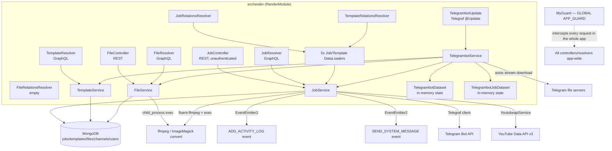
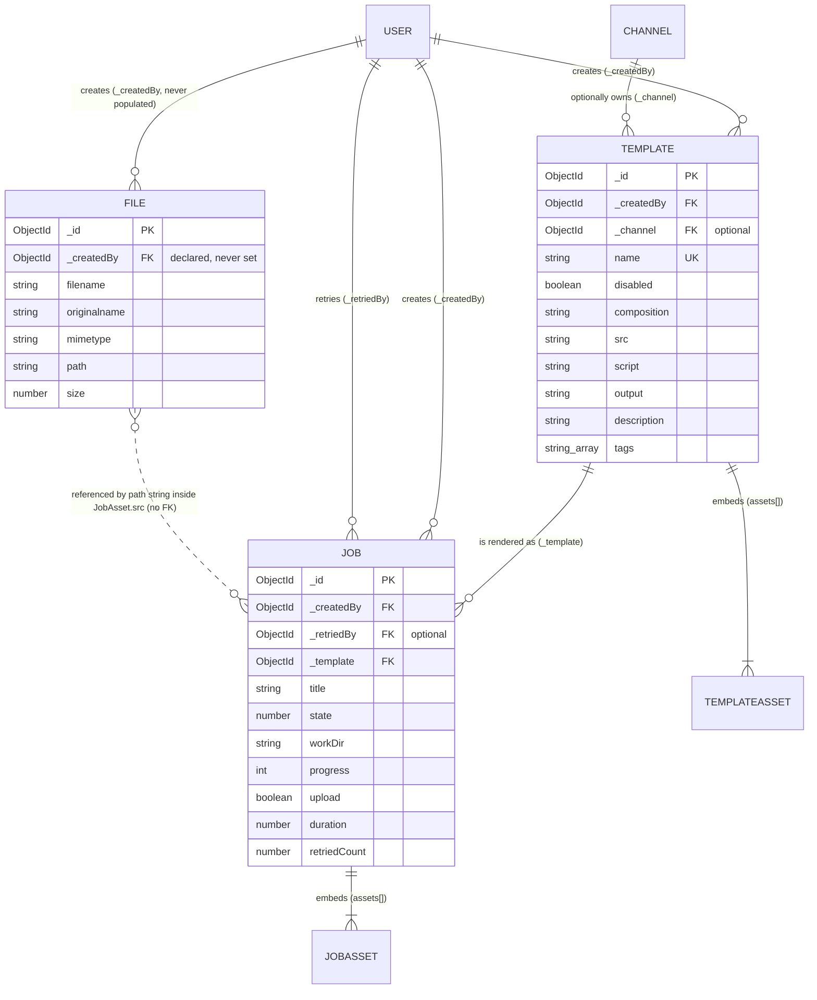
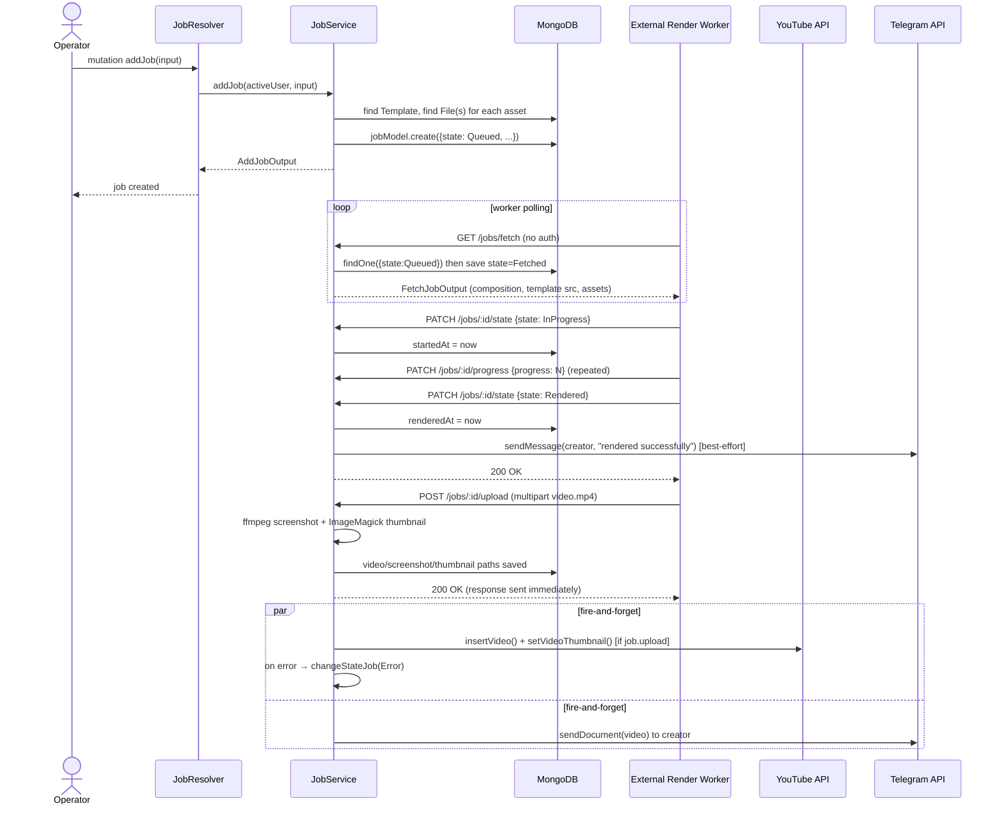
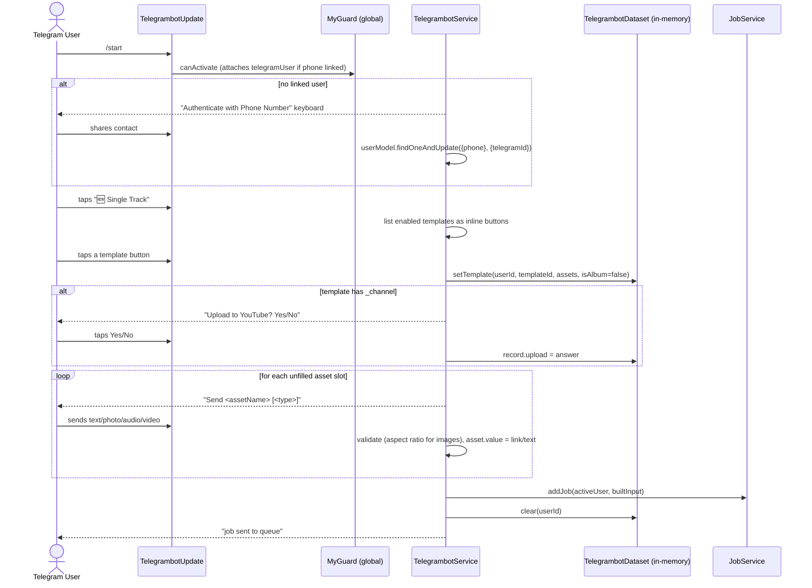

# `src/render` Module — Complete Technical Analysis

**Generated:** 2026-08-26
**Scope:** `/home/mahdirazaqi/Projects/qtical-backend-node/src/render` and everything it depends on.
**Method:** Full manual read of all 55 files under `src/render` (3,466 LOC) plus targeted tracing of every external import (auth, database, common, activity-log, message, channel, user, youtubeapi).
**Classification legend:** `CONFIRMED` = read directly in source. `INFERRED` = deduced from usage patterns/call sites. `UNKNOWN` = cannot be determined from code. `NEEDS_VERIFICATION` = requires runtime/infra/DB access to confirm.

> No source code was modified in the production of this document. This is the only file created.

---

## 0. TL;DR for an AI agent picking this up cold

`src/render` is the **video-rendering job orchestration module** of a YouTube-automation backend ("Qtical"). It does **not** render video itself. It:

1. Lets operators define reusable **Templates** (a composition definition + asset slots) via GraphQL.
2. Lets operators (via GraphQL, or via a **Telegram bot** conversational flow) create **Jobs** that bind concrete data/media to a Template's asset slots.
3. Exposes a small set of **unauthenticated REST endpoints** that an external render worker (not in this repo — `UNKNOWN`, presumably a Remotion/After-Effects-style renderer) polls to fetch queued jobs, report progress/duration, change job state, and upload the finished `.mp4`.
4. On successful upload, optionally pushes the video to **YouTube** (via `YoutubeapiService`) and/or **Telegram** (as a document), and/or in-app **system message** / **activity log**.
5. Manages generic uploaded **Files** (images/audio/video) used as job asset sources, transcoding them with `ffmpeg`/ImageMagick `convert` on upload.

The actual rendering engine, the queue between "Queued" and "Fetched", and the worker are **external systems** interacting only through the REST endpoints in `job.controller.ts`. This is the single most important architectural fact to internalize before changing anything here.

---

## 1. Complete File Inventory

```
src/render/
├── render.module.ts                                    [Module root]
├── file/
│   ├── file.controller.ts                               REST controller (upload)
│   ├── file.resolver.ts                                 GraphQL queries (getFile, getFiles)
│   ├── file-relations.resolver.ts                       GraphQL field resolver — EMPTY (see §21)
│   ├── file.service.ts                                  Business logic: transcode + CRUD
│   ├── dto/
│   │   ├── get-file.dto.ts                               GetFileOutput
│   │   ├── get-files.dto.ts                              FilterFilesInput/Output, GetFilesOutput
│   │   └── upload-job.dto.ts                             UploadFileInput (empty)/Output
│   ├── model/
│   │   └── file.filter.ts                                FileFilter (Mongo query builder)
│   └── schema/
│       └── file.schema.ts                                Mongoose+GraphQL File model
├── job/
│   ├── job.controller.ts                                 REST controller (worker-facing API)
│   ├── job.resolver.ts                                   GraphQL mutations/queries
│   ├── job-relations.resolver.ts                         GraphQL field resolvers (createdBy, retriedBy, template, renderTime, uploadTime)
│   ├── job.service.ts                                    Core business logic (largest file, 588 LOC)
│   ├── data-loader/
│   │   ├── created-by-in-job.dataloader.ts                Batches Job→User (_createdBy)
│   │   ├── retried-by-in-job.dataloader.ts                Batches Job→User (_retriedBy)
│   │   ├── template-in-job.dataloader.ts                  Batches Job→Template
│   │   ├── render-time-in-job.dataloader.ts               Computes derived renderTime (sec)
│   │   └── upload-time-in-job.dataloader.ts               Computes derived uploadTime (sec)
│   ├── dto/
│   │   ├── add-job.dto.ts                                 AddJobInput/Output
│   │   ├── cancel-job.dto.ts                              CancelJobOutput
│   │   ├── change-state-job.dto.ts                        ChangeStateJobOutput
│   │   ├── fetch-job.dto.ts                                FetchJobOutput (plain class, no GraphQL)
│   │   ├── get-job.dto.ts                                  GetJobOutput
│   │   ├── get-jobs.dto.ts                                 FilterJobsInput/Output, GetJobsOutput
│   │   ├── job-upload-limit.dto.ts                         GetUploadJobLimitOutput
│   │   ├── retry-job.dto.ts                                RetryJobOutput
│   │   ├── set-duration-job.dto.ts                         SetDurationJobOutput
│   │   ├── set-progress-job.dto.ts                         SetProgressJobOutput
│   │   └── upload-job-file.dto.ts                          UploadJobFileOutput
│   ├── model/
│   │   └── job.filter.ts                                   JobFilter (Mongo query builder)
│   └── schema/
│       ├── job.schema.ts                                   Mongoose+GraphQL Job model
│       ├── job-asset.schema.ts                             Embedded JobAsset sub-document
│       └── job.enum.ts                                      State enum (10 values)
├── template/
│   ├── template.resolver.ts                                GraphQL mutations/queries
│   ├── template-relations.resolver.ts                      GraphQL field resolvers (createdBy, channel)
│   ├── template.service.ts                                 Business logic (CRUD)
│   ├── data-loader/
│   │   ├── created-by-in-template.dataloader.ts             Batches Template→User
│   │   └── channel-in-template.dataloader.ts                Batches Template→Channel
│   ├── dto/
│   │   ├── add-template.dto.ts                              AddTemplateInput/Output
│   │   ├── edit-template.dto.ts                             EditTemplateInput/Output
│   │   ├── get-template.dto.ts                              GetTemplateOutput
│   │   └── get-templates.dto.ts                             FilterTemplatesInput/Output, GetTemplatesOutput
│   ├── model/
│   │   ├── image-ratio.enum.ts                              ImageRatio enum (GraphQL-registered)
│   │   └── template.filter.ts                               TemplateFilter (Mongo query builder)
│   └── schema/
│       ├── template.schema.ts                               Mongoose+GraphQL Template model
│       └── template-asset.schema.ts                         Embedded TemplateAsset sub-document
└── telegrambot/
    ├── telegrambot.update.ts                                Telegraf `@Update()` handler (entry point for all bot messages/actions)
    ├── telegrambot.service.ts                               Bot conversation logic (650 LOC, largest single class)
    ├── telegrambot.guard.ts                                 `MyGuard` — global APP_GUARD, resolves telegram user
    ├── telegrambot.decorator.ts                              `@SetTelegramUser()`, `@GetActiveUser()`, `@GetTelegrafContext()`
    ├── telegrambot.dataset.ts                                In-memory per-user conversation state (template/asset wizard)
    ├── telegrambot-job.dataset.ts                            In-memory per-user "last viewed job id" state
    ├── telegrambot.constant.ts                               Messages, keyboards, `Record`/`Asset`/`Collection` types
    └── event/
        └── add-activity-log.event.ts                         DEAD duplicate of src/activity-log's event (see §21/§22)
```

**Totals:** 55 files, 3,466 lines. No `.spec.ts` / test files exist anywhere under `src/render` (see §23).

### File-by-file usage/status summary

| File | Directly used by | Dead/unused? |
|---|---|---|
| `render.module.ts` | `app.module.ts` (imports `RenderModule`) | No |
| `file.controller.ts` | Express router (`POST /files`) | No |
| `file.resolver.ts` | GraphQL schema (`getFile`, `getFiles`) | No |
| `file-relations.resolver.ts` | Registered in `render.module.ts` providers | **Effectively dead** — resolves no fields (empty class body) |
| `file.service.ts` | `file.controller.ts`, `file.resolver.ts`, `telegrambot.service.ts` | No |
| `file/dto/*` | `file.service.ts`, `file.resolver.ts`, `file.controller.ts` | No |
| `file/model/file.filter.ts` | `file.service.ts` | No |
| `file/schema/file.schema.ts` | `database.module.ts` (model registration), all File DTOs, `job.service.ts` | No |
| `job.controller.ts` | Express router — presumed consumed by external render worker | No (but see §22 auth gap) |
| `job.resolver.ts` | GraphQL schema | No |
| `job-relations.resolver.ts` | Registered provider, resolves 5 fields on `Job` type | No |
| `job.service.ts` | `job.controller.ts`, `job.resolver.ts`, `telegrambot.service.ts` | No |
| `job/data-loader/*.ts` (5 files) | `job-relations.resolver.ts` | No |
| `job/dto/*` (11 files) | `job.service.ts`, `job.resolver.ts`, `job.controller.ts` | No |
| `job/model/job.filter.ts` | `job.service.ts` | No |
| `job/schema/job.schema.ts` | `database.module.ts`, `filter-generator.ts`(not template but similar pattern for `getJobItems` via activity-log), all Job DTOs | No |
| `job/schema/job-asset.schema.ts` | `job.schema.ts`, `job.service.ts`, `fetch-job.dto.ts` | No |
| `job/schema/job.enum.ts` | `job.schema.ts`, `job.service.ts`, `get-jobs.dto.ts`, `telegrambot.service.ts` | No |
| `template.resolver.ts` | GraphQL schema | No |
| `template-relations.resolver.ts` | Registered provider, resolves 2 fields on `Template` type | No |
| `template.service.ts` | `template.resolver.ts` | No |
| `template/data-loader/*.ts` (2 files) | `template-relations.resolver.ts` | No |
| `template/dto/*` (4 files) | `template.service.ts`, `template.resolver.ts` | No |
| `template/model/image-ratio.enum.ts` | `template-asset.schema.ts`, `telegrambot.service.ts` | No |
| `template/model/template.filter.ts` | `template.service.ts` | No |
| `template/schema/template.schema.ts` | `database.module.ts`, `filter-generator.ts`, `job.service.ts`, `job.schema.ts`, `telegrambot.service.ts` | No |
| `template/schema/template-asset.schema.ts` | `template.schema.ts` | No |
| `telegrambot.update.ts` | Registered as a `nestjs-telegraf` `@Update()` provider; wired automatically when `TelegrafModule` is active | No (conditional on `ENABLE_TELEGRAM=true`) |
| `telegrambot.service.ts` | `telegrambot.update.ts` | No |
| `telegrambot.guard.ts` (`MyGuard`) | Registered **globally** as `APP_GUARD` in `app.module.ts` — runs on **every** request in the app, not just render/telegram | No |
| `telegrambot.decorator.ts` | `telegrambot.update.ts`, `telegrambot.guard.ts` | No |
| `telegrambot.dataset.ts` | `telegrambot.service.ts` | No |
| `telegrambot-job.dataset.ts` | `telegrambot.service.ts` | No |
| `telegrambot.constant.ts` | `telegrambot.update.ts`, `telegrambot.service.ts` | No |
| `telegrambot/event/add-activity-log.event.ts` | **Nobody.** `job.service.ts`/`template.service.ts` import `ADD_ACTIVITY_LOG` from `src/activity-log/event/add-activity-log.event.ts` instead. | **Yes — confirmed dead code**, a byte-for-byte duplicate of the real event file. |

---

## 2. NestJS Architecture Overview



### Component inventory

| Type | Class | File |
|---|---|---|
| Module | `RenderModule` | `render.module.ts` |
| Controller (REST) | `FileController` | `file/file.controller.ts` |
| Controller (REST) | `JobController` | `job/job.controller.ts` |
| Resolver (GraphQL) | `FileResolver`, `FileRelationsResolver` | `file/*.ts` |
| Resolver (GraphQL) | `JobResolver`, `JobRelationsResolver` | `job/*.ts` |
| Resolver (GraphQL) | `TemplateResolver`, `TemplateRelationsResolver` | `template/*.ts` |
| Service | `FileService`, `JobService`, `TemplateService`, `TelegrambotService` | respective `*.service.ts` |
| Provider (state store) | `TelegrambotDataset`, `TelegrambotJobDataset` | `telegrambot/*.dataset.ts` |
| Guard | `MyGuard` (telegram user resolution, global) | `telegrambot/telegrambot.guard.ts` |
| Decorator | `@SetTelegramUser()`, `@GetActiveUser()`, `@GetTelegrafContext()` | `telegrambot/telegrambot.decorator.ts` |
| Update handler (Telegraf) | `TelegrambotUpdate` | `telegrambot/telegrambot.update.ts` |
| DataLoader (request-scoped) | 7 total: `CreatedByInJobDataloader`, `RetriedByInJobDataloader`, `TemplateInJobDataloader`, `RenderTimeInJobDataloader`, `UploadTimeInJobDataloader`, `CreatedByInTemplateDataloader`, `ChannelInTemplateDataloader` | `job/data-loader/*`, `template/data-loader/*` |
| Queue registration | `thumbnail-conversion` (Bull) | `render.module.ts` — registered but **not consumed anywhere inside `src/render`**; needed only because `RenderModule` locally re-declares `YoutubeapiService`, which itself injects this queue (see §12, §22). |
| Guard (permission) | Not defined here, reused: `PermissionsGuard` (GraphQL), `PermissionsRestGuard` (REST), `AuthGuard` (GraphQL `@Auth()`), `RestAuth`/`PermissionsRest` (REST) | `src/auth/guard/*` |
| Pipe / Middleware / Filter / Strategy / Gateway | None defined in this module | — |
| Scheduled jobs (cron) | None in this module | — |
| Event handlers (emitters) | `ADD_ACTIVITY_LOG` (from `src/activity-log`), `SEND_SYSTEM_MESSAGE` (from `src/message`) — both emitted, **listened to outside the module** | `src/activity-log/listener/add-activity-log.listener.ts`, `src/message/listener/send-system-message.listener.ts` |

### Per-component detail

#### `FileController` (`file/file.controller.ts`)
- **Route:** `POST /files`, multipart/form-data, field `file`.
- **Auth:** `@RestAuth()` + `@PermissionsRest(ActionEnum.FILE_ADD)` — CONFIRMED authenticated + permission-checked.
- **Pipes/Interceptors:** `FileInterceptor('file', uploaderOptions)` — Multer disk storage to `./assets`, filename = `Date.now()-sanitized-original-name`, extension whitelist `.jpg .jpeg .png .webp .mp4 .mp3` (case variants).
- **Calls:** `FileService.uploadFile(file)`.
- **Returns:** `UploadFileOutput` (`{ message, file }`).
- **Side effects:** writes file to local disk under `assets/`; spawns `ffmpeg`/`convert` child process (see §15).
- **Errors:** `BadRequestException` if extension not whitelisted.

#### `JobController` (`job/job.controller.ts`)
- **Routes:** `GET /jobs/fetch`, `GET /jobs/:id`, `PATCH /jobs/:id/progress`, `PATCH /jobs/:id/duration`, `PATCH /jobs/:id/state`, `POST /jobs/:id/upload`.
- **Auth:** **NONE.** No `@RestAuth()`, no guard decorator of any kind on the controller or any handler. CONFIRMED by direct inspection — this is the intended machine-to-machine surface for the external render worker, but as written it is open to anyone who can reach the API. See §17, §22 (Critical finding).
- **Pipes:** none (raw `@Body('progress')`, `@Body('duration')`, `@Body('state')` — no DTO validation pipe, no `ParseIntPipe`).
- **Upload endpoint interceptor:** `FileInterceptor('file', { storage: diskStorage to ./assets/jobs/:id, filename fixed to video<ext> })`, `fileFilter` restricts to `.mp4` only.
- **Calls:** `JobService.fetch/getJob/setProgressJob/setDurationJob/changeStateJob/uploadJobFile`.

#### `JobResolver` / `TemplateResolver` / `FileResolver`
- All GraphQL, guarded by `@Permissions(ActionEnum.X)` → `PermissionsGuard` (role-based ACL, see §17).
- `JobResolver` and `FileResolver` additionally declare class-level `@Auth()` (→ `AuthGuard`, throws 401 if no `req.user`/`req.workspace`).
- **`TemplateResolver` does NOT have `@Auth()`** at the class level (confirmed by direct read) — it relies solely on `@Permissions()`. Functionally `PermissionsGuard` already denies access if `req.user`/`workspace`/`role` are absent, so this is not an authentication bypass, but it is an inconsistency in the codebase's declared security posture and produces a different error type (403 Forbidden vs 401 Unauthorized) for template endpoints vs. job/file endpoints. See §22.

#### `JobRelationsResolver` / `TemplateRelationsResolver`
- Pure `@ResolveField()` GraphQL field resolvers, backed 1:1 by request-scoped DataLoaders to avoid N+1 queries when a list of Jobs/Templates is returned and clients request nested `createdBy`/`template`/`channel`/etc.
- `renderTime` / `uploadTime` on `Job` are **computed, not stored** fields (see §5 Job model, §21).

#### `TelegrambotUpdate` (`telegrambot/telegrambot.update.ts`)
- A `nestjs-telegraf` `@Update()` class — the single entry point Telegraf routes all incoming Telegram updates through, dispatched to handlers by `@Start()`, `@On('contact'|'message')`, `@Hears(text)`, `@Action(regex|array)`.
- **Wiring:** only active if `TelegrafModule` is registered, which only happens when `process.env.ENABLE_TELEGRAM === 'true'` (`app.module.ts`).
- **Auth:** every handler is annotated `@SetTelegramUser()`, which sets `TELEGRAM_BOT_KEY` reflection metadata consumed by the **globally-registered** `MyGuard`. `MyGuard` looks up the Telegram user by `req.from.id` (Telegram user id) via `UserService.getUserByTelegramId`, and attaches `req.telegramUser`/`req.workspace` if found — it does **not** block unauthenticated Telegram users; it always returns `true`, it just conditionally attaches user context. Each individual handler method then checks `if (activeUser) {...} else this.telegrambotService.userNotFound(ctx)`.

#### `MyGuard` (`telegrambot.guard.ts`)
- Registered as `APP_GUARD` — runs on **every single request in the entire application** (all REST, all GraphQL, all Telegram updates), not scoped to the render module.
- **Behavior on non-Telegram requests:** `req.from?.id` is undefined for ordinary HTTP requests ⇒ guard short-circuits (`if (telegramId)` false) and returns `true` unconditionally — effectively a no-op for the rest of the app. CONFIRMED harmless for non-Telegram traffic but worth knowing it exists globally.
- **Side effect:** mutates the request object (`req.workspace`, `req.telegramUser`) — this is how "auth" state crosses from a bare Telegraf context object into the rest of the request pipeline for bot handlers.

---

## 3. Data Models

### 3.1 `Template` (`template/schema/template.schema.ts`)

- **Mongo collection:** `templates`
- **Timestamps:** `createdAt`/`updatedAt` auto-managed (`timestamps: true`), no `versionKey` (`__v` disabled)
- **Purpose:** Defines a reusable render "recipe" — which composition/script to run, what output naming convention to use, and what asset "slots" (`TemplateAsset[]`) a Job must fill in before it can render.

| Field | Type | Required | Nullable | Default | Relation | Description |
|---|---|---|---|---|---|---|
| `_id` | ObjectId | auto | No | auto | PK | Inherited from `CoreSchema` |
| `_createdBy` | ObjectId → User | Yes (validator) | No | — | FK → `users` | Operator who created the template |
| `name` | string | Yes | No | — | — | **Unique** (`unique: true` index), trimmed. Display/lookup name. |
| `_channel` | ObjectId → Channel | No | Yes | — | FK → `channels` | If set, jobs from this template are eligible for automatic YouTube upload to this channel (drives the "Do you want this job to be uploaded?" prompt in the bot, and `uploadJobToYoutube`). |
| `disabled` | boolean | Yes (schema) | No | `false` | — | Templates with `disabled: true` are hidden from the Telegram bot's template pickers (`addJob`/`addAlbum` filter `disabled: false`) but are **still selectable via the GraphQL `addJob` mutation** (no disabled check in `JobService.addJob`) — see §21 hidden behavior. |
| `composition` | string | Yes | No | — | — | Identifier of the render composition (e.g. a Remotion/After Effects composition name) passed through to the worker via `FetchJobOutput.composition`. |
| `src` | string | Yes | No | — | — | Path/URL to the template's source project, returned to the worker as `FetchJobOutput.template`. |
| `script` | string | Yes | No | — | — | Path to a script asset, automatically injected into every job's `assets[0]` as `{ type: 'script', src: template.script }`. |
| `output` | string | Yes | No | — | — | Output directory template; copied verbatim into `Job.workDir` at job-creation time. |
| `assets` | `TemplateAsset[]` | Yes | No | — | Embedded | The ordered list of asset slots a Job must supply values for. |
| `description` | string | No | Yes | — | — | Used as the YouTube video description on upload. |
| `tags` | string[] | No | Yes | — | — | YouTube tag templates, may contain `{{layer}}` placeholders resolved per-job by `JobService.processTags`. |

**Indexes:** `name` has a unique index (from `@Prop({ unique: true })`). No other explicit indexes. `_channel`/`_createdBy` are unindexed FK-style fields — `NEEDS_VERIFICATION` whether Mongo auto-indexes on `_id` refs only (it does not, by default, unless explicitly declared) — so lookups filtered by `_channel` elsewhere (`FilterGenerator`) would be full collection scans. Not directly exercised by `TemplateFilter` today.

**GraphQL exposure:** `@InputType('TemplateInputType')` and `@ObjectType()` on the **same class** — the schema doubles as both the GraphQL output type and (via `PickType`) the basis for input DTOs.

**Validation:** `class-validator` decorators (`@IsString`, `@IsArray`, `@IsObjectId`, `@IsOptional`) are present on the schema class, but **CONFIRMED these are not actually enforced anywhere** — no `ValidationPipe`/`class-validator` invocation is visible in the render module's resolvers or controllers (NestJS GraphQL uses its own type-coercion, not `class-validator`, unless a global `ValidationPipe` is registered — `NEEDS_VERIFICATION` at `app.module.ts` level, out of scope here). Treat these decorators as **documentation-only unless proven otherwise**.

#### `TemplateAsset` (embedded, `template/schema/template-asset.schema.ts`)

Not a separate collection — an array of sub-documents stored inline on `Template.assets`.

| Field | Type | Required | Description |
|---|---|---|---|
| `name` | string | Yes | Slot identifier; must match a key in `AddJobInput.assets` at job-creation time, and is used verbatim as the placeholder key `{{name}}` isn't used — actually `{{layer}}` is used for tag substitution, `name` is the lookup key into `input.assets`. |
| `composition` | string | Yes | Sub-composition/layer group identifier passed through to the worker via `JobAsset.composition`. |
| `layer` | string | Yes | Layer name inside the composition; also the placeholder token (`{{layer}}`) used in `Template.tags` substitution. |
| `type` | string | Yes | Free-text, not an enum. Observed values in code: `'data'` (plain text), `'image'`, `'audio'`, `'video'`, and the auto-injected `'script'` (added only server-side, never part of `TemplateAsset`). Anything else is treated as a file-reference asset (`JobService.addJob`'s `else` branch does an unconditional `fileModel.findById`). |
| `imageRatio` | `ImageRatio` enum | Yes (default `None`) | Constrains uploaded image aspect ratio in the Telegram flow only (`ImageRatio.Portrait 9:16`, `Landscape 16:9`, `Square`, `None`). **Not enforced on the GraphQL/REST `addJob` path** — only `TelegrambotService.assetListener`/`dataListener` check it. |

#### `ImageRatio` enum (`template/model/image-ratio.enum.ts`)
```
Portrait  = '9:16'
Landscape = '16:9'
Square    = 'square'
None      = 'none'
```
Registered as GraphQL enum `ImageRatio`.

---

### 3.2 `Job` (`job/schema/job.schema.ts`)

- **Mongo collection:** `jobs`
- **Purpose:** A single concrete render request — a Template with all asset slots filled in, tracked through a state machine from creation to (optionally) YouTube/Telegram delivery.

| Field | Type | Required | Nullable | Default | Relation | GraphQL exposed? | Description |
|---|---|---|---|---|---|---|---|
| `_id` | ObjectId | auto | No | auto | PK | Yes | |
| `_createdBy` | ObjectId → User | Yes | No | — | FK → `users` | Yes | Who created the job (GraphQL/Telegram initiator). |
| `_retriedBy` | ObjectId → User | validator says required, GraphQL says nullable | Yes | — | FK → `users` | Yes | Set only when a job is the *result* of a retry; who triggered the retry. **Validator/GraphQL mismatch** — see §22. |
| `_template` | ObjectId → Template | Yes | No | — | FK → `templates` | Yes | The template this job renders. |
| `title` | string | Yes | No | — (derived) | — | Yes | Auto-built at creation: concatenation of all `type:'data'` asset values, joined with `" | "`, in template-asset order. |
| `state` | number (State enum) | Yes | No | `0` (Queued) | — | Yes, but typed `Number` not the `StateEnumType` GraphQL enum | The job's lifecycle state (see State machine below). |
| `workDir` | string | Yes | No | — | — | Yes | Copied from `Template.output` at creation, or from the prior job's `workDir` on retry. |
| `assets` | `JobAsset[]` | Yes | No | — | Embedded | Yes | Resolved asset list: `[{type:'script',src:...}, ...one entry per template asset...]`. |
| `progress` | int | Yes | No | `0` | — | Yes | 0–100 (not enforced), set via `PATCH /jobs/:id/progress`. |
| `lastProgress` | Date | — | Yes | — | — | **No `@Field()` — not exposed in GraphQL at all** | Timestamp of the last progress update; internal/DB-only. Cleared (`null`) on `Rendered`/`Uploaded`. |
| `upload` | boolean | Yes | No | `false` | — | Yes | Whether this job should be pushed to YouTube after render. |
| `duration` | number | Yes | No | `0` | — | Yes | Rendered video duration (seconds, presumably) — set via `PATCH /jobs/:id/duration`, by the worker. |
| `retriedCount` | number | Yes | No | `0` | — | Yes | Incremented each time the job lineage is retried. |
| `startedAt` | Date | — | Yes | — | — | Yes | Set when state → `InProgress`. |
| `renderedAt` | Date | — | Yes | — | — | Yes | Set when state → `Rendered`. |
| `uploadedAt` | Date | — | Yes | — | — | Yes | Set when state → `Uploaded`. |
| `canceledAt` | Date | — | Yes | — | — | Yes | Set when job is cancelled. |
| `video` | string | — | Yes | — | — | Yes | Local disk path to the uploaded rendered `.mp4` (set by `uploadJobFile`). |
| `screenshot` | string | — | Yes | — | — | Yes | Local disk path to a full-size JPEG frame grab (ffmpeg screenshot at 4s). |
| `thumbnail` | string | — | Yes | — | — | Yes | Local disk path to a 150px-wide resized version of `screenshot` (ImageMagick `convert`). |

**Derived/computed fields (not stored):**
- `renderTime` (GraphQL field, resolved via `RenderTimeInJobDataloader`) = `(renderedAt - startedAt) / 1000` seconds, or `0` if either timestamp missing.
- `uploadTime` (via `UploadTimeInJobDataloader`) = `(uploadedAt - renderedAt) / 1000` seconds, or `0` if either missing.
- `createdBy`, `retriedBy`, `template` GraphQL fields = populated versions of `_createdBy`/`_retriedBy`/`_template` (the underscore-prefixed fields hold the raw ObjectId; the non-prefixed fields are resolver-only joins).

**Indexes:** None explicit beyond `_id`. Queries filter/sort on `state`, `_createdBy`, `_template`, `createdAt` frequently (see §11) with no supporting indexes defined in this schema — `NEEDS_VERIFICATION` against actual deployed Mongo indexes (may exist out-of-band).

#### State machine (`job/schema/job.enum.ts`)

```
0 Queued → 1 Fetched → 2 Downloading → 3 Started → 4 InProgress → 5 Rendered → 6 Uploading → 7 Uploaded
                                                                        ↘ 8 Error
(any non-terminal state) → 9 Cancel
```

| Value | Name | Set by | Confirmed in this codebase? |
|---|---|---|---|
| 0 | `Queued` | `JobService.addJob`, `JobService.retryJob` | Yes |
| 1 | `Fetched` | `JobService.fetch` (`GET /jobs/fetch`) | Yes |
| 2 | `Downloading` | — | **Never set anywhere in this repo.** Presumably set by the external worker directly via `PATCH /jobs/:id/state` with the raw number `2`. `INFERRED`. |
| 3 | `Started` | — | **Never set anywhere in this repo.** Same as above, `INFERRED`. |
| 4 | `InProgress` | External worker via `PATCH /jobs/:id/state` (handled specially in `changeStateJob`: sets `startedAt`) | Yes |
| 5 | `Rendered` | External worker via same endpoint (sets `renderedAt`, clears `lastProgress`, sends Telegram notice + system message) | Yes |
| 6 | `Uploading` | Only referenced as an **excluded** state in guard conditions (`cancelJob`, `retryJob`); never explicitly *set*. `INFERRED` — presumably the worker or `uploadJobToYoutube` conceptually occupies this state but the code never calls `changeStateJob(id, State.Uploading)`. |
| 7 | `Uploaded` | External worker via same endpoint (sets `uploadedAt`, clears `lastProgress`, sends Telegram notice) | Yes |
| 8 | `Error` | External worker via same endpoint (sends Telegram failure notice); also internally by `uploadJobToYoutube` on caught exception | Yes |
| 9 | `Cancel` | `JobService.cancelJob` (GraphQL `cancelJob` mutation, or Telegram cancel actions) | Yes |

**Important:** `changeStateJob` accepts **any integer** for `state` with no bounds/enum validation (REST body is `@Body('state') state: number`) — an out-of-range or negative value will be saved as-is into `job.state`, and the `switch` simply falls through with no side effects for unrecognized values.

#### `JobAsset` (embedded, `job/schema/job-asset.schema.ts`)

| Field | Type | Required | Description |
|---|---|---|---|
| `composition` | string | No | Copied from `TemplateAsset.composition`. |
| `layer` | string | No | Copied from `TemplateAsset.layer`. |
| `type` | string | Yes | `'script'` \| `'data'` \| `'image'` \| `'audio'` \| `'video'` (free text, not enum-enforced). |
| `src` | string | No | File path (for `'script'` and file-backed asset types — resolved from `File.path`). |
| `text` | string | No | Literal text value (for `'data'` type assets). |

---

### 3.3 `File` (`file/schema/file.schema.ts`)

- **Mongo collection:** `files`
- **Purpose:** Generic uploaded-media registry (images/audio/video) referenced by `JobAsset.src`. Acts as a lightweight, mimetype-tagged asset library independent of the job/template system, also used as the destination for files the Telegram bot downloads from Telegram's CDN before attaching them to a job.

| Field | Type | Required | Nullable | Default | Relation | Description |
|---|---|---|---|---|---|---|
| `_id` | ObjectId | auto | No | auto | PK | |
| `_createdBy` | ObjectId → User | Yes (schema) | No | — | FK → `users` | **Never actually set** by `FileService.uploadFile` (the `.create()` call omits `_createdBy` entirely) — always ends up `undefined` in the DB despite the schema modeling it as present. See §22. |
| `filename` | string | Yes | No | — | — | Post-transcode filename (`name-converted.ext`). |
| `originalname` | string | Yes | No | — | — | Original client-supplied filename. |
| `mimetype` | string | Yes | No | — | — | MIME type from Multer/client `Content-Type`. |
| `path` | string | Yes | No | — | — | Absolute/relative disk path to the (converted) file — this is the value copied into `JobAsset.src`. |
| `size` | number | Yes | No | — | — | Byte size. **Decorated `@IsDate()` instead of `@IsNumber()`** — copy-paste validation bug (inert since validators aren't enforced here anyway; see §22). |

**Note:** `File` has no `channel`/`workspace` scoping field at all — it is a **global, unscoped** collection; any authenticated user with `FILE_VIEW` can see every file ever uploaded by anyone (see §6, §22).

---

## 4. Relationships Between Models



### Relationship notes

| Relationship | Owning side | Stored reference | Cascade on delete? | Can exist independently? | Mandatory/Optional |
|---|---|---|---|---|---|
| Template → User (`_createdBy`) | Template | `Template._createdBy` | **No cascade** — deleting a User does not touch Templates (no code path found). | Template rows become orphaned if the User is deleted. | Mandatory (schema-level, not DB-enforced) |
| Template → Channel (`_channel`) | Template | `Template._channel` | No cascade. | Yes — a template with no `_channel` is fully valid (means "never upload to YouTube"). | Optional |
| Job → Template (`_template`) | Job | `Job._template` | **No cascade.** `TEMPLATE_REMOVE` permission exists in `ActionEnum` but **no delete mutation is implemented anywhere in `TemplateResolver`/`TemplateService`** — templates can never be deleted through this module's API today, so orphaning risk is currently theoretical. See §22. | No — every Job creation path (`addJob`) requires an existing Template (`NotFoundException` otherwise). Once created, the Job document is self-contained (assets are copied by value, not by reference) and would survive template deletion if that ever becomes possible. | Mandatory |
| Job → User (`_createdBy`) | Job | `Job._createdBy` | No cascade. | No, mandatory at creation. | Mandatory |
| Job → User (`_retriedBy`) | Job | `Job._retriedBy` | No cascade. | Yes, most jobs have none. | Optional |
| Job asset → File | **By value, not reference** | `JobAsset.src` stores the **file path string** copied out of `File.path` at job-creation time, not the File's ObjectId. | N/A — no live FK at all. | Yes, fully decoupled — deleting/moving the underlying File document or its disk file has **no referential integrity check**; a Job's `assets[].src` would silently point to a dead path. | N/A |
| Template embeds TemplateAsset | 1‑to‑many, embedded | Array field, no separate collection/PK | Deleting the Template deletes its assets (embedded doc). | No, cannot exist outside a Template. | Part of Template |
| Job embeds JobAsset | 1‑to‑many, embedded | Array field, no separate collection/PK | Deleting the Job deletes its assets. | No. | Part of Job |

```text
User
  └── has many
      └── Template (as creator)
      └── Job (as creator, as retrier)
      └── File (as creator — modeled but never populated)

Channel
  └── has many (optional)
      └── Template

Template
  └── has many
      └── Job (rendering instances)
  └── embeds
      └── TemplateAsset[] (asset slot definitions)

Job
  └── embeds
      └── JobAsset[] (resolved asset values)
  └── references by value (no FK)
      └── File.path (copied into JobAsset.src at creation time)
```

---

## 5. DTOs and Validation

**Validation stack in use:** `class-validator` decorators are declared on the Mongoose/GraphQL schema classes themselves (`Template`, `Job`, `File`, `TemplateAsset`, `JobAsset`) and reused by DTOs via `PickType`. **No Zod, no Joi, no custom pipes** are used inside `src/render`. `class-transformer` is not explicitly invoked here either.

**Critical caveat (CONFIRMED by absence of evidence):** none of the render module's controllers or resolvers apply a `ValidationPipe`, `@UsePipes()`, or any DTO-level validation invocation. GraphQL mutations get their type coercion "for free" from `@nestjs/graphql`'s SDL-based argument parsing (wrong *types* are rejected, e.g. a string where an Int is expected), but the `class-validator` decorators (`@IsString`, `@IsObjectId`, etc.) are **not wired to run** anywhere visible in this module. Unless a global `ValidationPipe` exists in `main.ts`/`app.module.ts` (`NEEDS_VERIFICATION`, out of scope), these decorators are inert documentation. The REST `JobController` explicitly uses raw `@Body('field')` extraction with **zero** validation of any kind.

### Template DTOs

| DTO | Direction | Fields (via `PickType(Template, [...])`) | Notes |
|---|---|---|---|
| `AddTemplateInput` | Input | `name, _channel, disabled, composition, src, script, output, assets, description, tags` | All fields required exactly as declared on `Template` (no `PartialType`), so e.g. `disabled` must be provided even though it "defaults" to `false` at the schema level — GraphQL will require it unless the field itself is nullable in SDL. |
| `AddTemplateOutput` | Output | `message` (from `CoreOutput`) + `template?: Template` | |
| `EditTemplateInput` | Input | Same field list as `AddTemplateInput` | **Uses `PickType`, not `PartialType`** — this is a full-replace edit DTO, not a patch DTO. A client must resend every field on every edit or GraphQL will reject the mutation for missing non-nullable fields. |
| `EditTemplateOutput` | Output | `message` + `template?` | |
| `GetTemplateOutput` | Output | `message` + `template?` | |
| `FilterTemplatesInput` | Input | Inherits `CoreFilter`: `q?, page?, limit?, sort?` | No template-specific filter fields (no filter by `_channel`, `disabled`, `tags`, etc.) |
| `FilterTemplatesOutput` / `GetTemplatesOutput` | Output | Echoes filter + `templates[]` + `pagination` | |

### Job DTOs

| DTO | Direction | Fields | Notes |
|---|---|---|---|
| `AddJobInput` | Input | `_template, upload` (via `PickType`) + `assets: object` (typed `GraphQLJSONObject` — **arbitrary JSON**, not validated against the template's asset schema until service-layer processing) | The `assets` map's keys must match `TemplateAsset.name` values; validated at runtime in `JobService.addJob`, not by the DTO. |
| `AddJobOutput` | Output | `message` + `job?` | |
| `CancelJobOutput` | Output | `message` + `jobs: Job[]` | |
| `ChangeStateJobOutput`, `RetryJobOutput`, `SetDurationJobOutput`, `SetProgressJobOutput`, `UploadJobFileOutput` | Output | `message` only (`CoreOutput`) | |
| `FetchJobOutput` | Output | Plain TS class (**not** a GraphQL `@ObjectType`, only used for the REST `/jobs/fetch` response): `id, output, title, composition, template, assets` | |
| `GetJobOutput` | Output | `message` + `job?` | |
| `FilterJobsInput` | Input | `CoreFilter` fields + `_createdBy?, _template?, state?, from?, to?` | `state` typed as the GraphQL `State` enum (named values), inconsistent with `Job.state`'s raw-`Number` GraphQL type — see §22. |
| `FilterJobsOutput` / `GetJobsOutput` | Output | Echoes filter (including resolved `template`/`createdBy` objects via `FilterGenerator`) + `jobs[]` + `pagination` | |
| `GetUploadJobLimitOutput` | Output | `canUpload: boolean, totalCapacity: number, freeCapacity: number` | Not a `CoreOutput` subclass (no `message`). |

### File DTOs

| DTO | Direction | Fields | Notes |
|---|---|---|---|
| `UploadFileInput` | Input | **Empty class** — the actual file comes from Multer's `@UploadedFile()`, not a GraphQL/body field. | |
| `UploadFileOutput` | Output | `message` + `file?` | |
| `GetFileOutput` | Output | `message` + `file?` | |
| `FilterFilesInput` | Input | Extends `FilterOptions` (not `CoreFilter`) + explicit `q?` (redundant re-declaration — `FilterOptions` already defines `q`) | Minor duplication, harmless. |
| `FilterFilesOutput` / `GetFilesOutput` | Output | `q?` + `files?[]` + `pagination` + `filters` | |

### What happens with invalid data?

- **GraphQL layer:** Wrong *type* (e.g. sending a string for an Int arg) is rejected by `@nestjs/graphql`'s schema-first/type coercion before hitting the resolver, with a standard GraphQL `BAD_USER_INPUT`-style error. Business-rule invalidity (e.g. missing asset, unknown template id) surfaces as a `NotFoundException` thrown inside the service (→ GraphQL error `NOT_FOUND`/500-style depending on `GqlExceptionFilter` config, `NEEDS_VERIFICATION`).
- **REST `JobController` layer:** No validation at all beyond Multer's `fileFilter` (extension check) for the upload endpoint. `@Body('state') state: number` accepts any JSON value NestJS's default body parser hands it; if a non-numeric value is sent it is stored as-is (Mongoose will coerce/reject at save time depending on schema strictness — `NEEDS_VERIFICATION`).
- **`addJob` asset resolution:** if a required template asset key is missing from `input.assets`, or a referenced `File._id` doesn't exist, `JobService.addJob` throws `NotFoundException` with a descriptive message (`"${asset.name} not found"` / `'file not found'`). If the supplied file id string is not a valid ObjectId at all, `fileModel.findById(value)` throws a Mongoose `CastError`, which is **not caught** — this surfaces as an unhandled 500 rather than the intended 404. See §16, §22.

---

## 6. Controllers / API Endpoints

### REST

| Method | Route | Auth | Guards | Input | Output | Service method | Description |
|---|---|---|---|---|---|---|---|
| POST | `/files` | **Required** (`@RestAuth()`) | `RestAuth`, `PermissionsRest(FILE_ADD)` | multipart `file` (jpg/jpeg/png/webp/mp4/mp3) | `UploadFileOutput` | `FileService.uploadFile` | Upload+transcode a media asset for later use as a job asset. |
| GET | `/jobs/fetch` | **None** | — | — | `FetchJobOutput` (404 if no queued job) | `JobService.fetch` | Worker polls this to claim the oldest queued job; flips it to `Fetched`. |
| GET | `/jobs/:id` | **None** | — | `id` path param | `GetJobOutput` | `JobService.getJob` | Fetch a single job by id. |
| PATCH | `/jobs/:id/progress` | **None** | — | `{ progress: number }` | `SetProgressJobOutput` | `JobService.setProgressJob` | Worker reports render progress %. |
| PATCH | `/jobs/:id/duration` | **None** | — | `{ duration: number }` | `SetDurationJobOutput` | `JobService.setDurationJob` | Worker reports rendered video duration. |
| PATCH | `/jobs/:id/state` | **None** | — | `{ state: number }` | `ChangeStateJobOutput` | `JobService.changeStateJob` | Worker advances the job's lifecycle state; triggers notifications on `Rendered`/`Uploaded`/`Error`. |
| POST | `/jobs/:id/upload` | **None** | — | multipart `file` (`.mp4` only) | `UploadJobFileOutput` | `JobService.uploadJobFile` | Worker delivers the finished render; triggers screenshot/thumbnail generation and fire-and-forget YouTube/Telegram delivery. |

### GraphQL

| Type | Name | Auth | Permission | Args | Output | Service method | Description |
|---|---|---|---|---|---|---|---|
| Mutation | `addTemplate` | *(no `@Auth()` class guard — see §2)* | `TEMPLATE_ADD` | `input: AddTemplateInput` | `AddTemplateOutput` | `TemplateService.addTemplate` | Create a template; emits `ADD_ACTIVITY_LOG`. |
| Mutation | `editTemplate` | *(same)* | `TEMPLATE_UPDATE` | `_id, input: EditTemplateInput` | `EditTemplateOutput` | `TemplateService.editTemplate` | Full-replace edit; emits `ADD_ACTIVITY_LOG` with before/after diff. 404 if not found. |
| Query | `getTemplate` | *(same)* | `TEMPLATE_VIEW` | `_id` | `GetTemplateOutput` | `TemplateService.getTemplate` | 404 if not found. |
| Query | `getTemplates` | *(same)* | `TEMPLATE_VIEW` | `input: FilterTemplatesInput` | `GetTemplatesOutput` | `TemplateService.getTemplates` | Paginated list + search by `name`. |
| Mutation | `addJob` | `@Auth()` | `JOB_ADD` | `input: AddJobInput` | `AddJobOutput` | `JobService.addJob` | Create a job from a template + asset values; enforces daily upload cap if `upload:true`. |
| Query | `getJob` | `@Auth()` | `JOB_VIEW` | `_id` | `GetJobOutput` | `JobService.getJob` | 404 if not found. |
| Query | `getJobs` | `@Auth()` | `JOB_VIEW` | `input: FilterJobsInput` | `GetJobsOutput` | `JobService.getJobs` | Paginated list with filters; `activeUser` param present in signature but **not decorated with `@ActiveUser()`**, so always `undefined` (harmless, unused inside the service method). |
| Query | `getUploadJobLimit` | `@Auth()` | `JOB_ADD` | — | `GetUploadJobLimitOutput` | `JobService.getUploadJobLimit` | Reports the global daily YouTube-upload quota (hardcoded cap of 3/day, all users combined). |
| Mutation | `retryJob` | `@Auth()` | `JOB_RETRY` | `_id` | `RetryJobOutput` | `JobService.retryJob` | Deletes+recreates a failed/queued job (within 3 days, not already rendered/uploading/uploaded). |
| Mutation | `cancelJob` | `@Auth()` | `JOB_CANCEL` | `_ids: [ObjectId]` (nullable) | `CancelJobOutput` | `JobService.cancelJob` | Bulk-cancel; skips jobs already Rendered/Uploading/Uploaded/Cancelled. |
| Query | `getFile` | `@Auth()` | `FILE_VIEW` | `_id` | `GetFileOutput` | `FileService.getFile` | 404 if not found. No ownership/workspace scoping — any authorized user can fetch any file by id. |
| Query | `getFiles` | `@Auth()` | `FILE_VIEW` | `input: FilterFilesInput` | `GetFilesOutput` | `FileService.getFiles` | Paginated list, search by `filename`. Same lack of scoping. |

**No GraphQL delete mutations exist** for Template, Job, or File (despite `ActionEnum.TEMPLATE_REMOVE` existing in the permission enum — dead permission, see §22).

---

## 7. Service Logic — Method-by-Method

### `TemplateService`

| Method | Params | Returns | Flow |
|---|---|---|---|
| `addTemplate(activeUser, input)` | `ActiveUserType, AddTemplateInput` | `AddTemplateOutput` | 1) `templateModel.create({_createdBy: activeUser.user._id, ...input})` 2) emit `ADD_ACTIVITY_LOG` (`type: Create`) 3) return success message + doc. No pre-check for duplicate `name` in code — relies entirely on the Mongo unique index to reject duplicates (which would surface as an unhandled `MongoServerError` E11000, not a friendly 400 — see §16). |
| `editTemplate(activeUser, _id, input)` | | `EditTemplateOutput` | 1) load `oldTemplate` (for diffing) 2) `findOneAndUpdate({_id}, {...input}, {new:true})` (full replace of all picked fields) 3) 404 if not found 4) emit `ADD_ACTIVITY_LOG` (`type: Update`, `from`/`to` = full before/after object) 5) return. |
| `getTemplate(_id, activeUser)` | | `GetTemplateOutput` | Simple `findById`; 404 if missing. `activeUser` param unused in body. |
| `getTemplates(input, activeUser)` | | `GetTemplatesOutput` | Builds `TemplateFilter` (search on `name`, default sort `disabled` ascending — i.e., enabled templates surface before disabled ones), runs `find` + `countDocuments`, enriches echoed filters via `FilterGenerator`. **No `accessFilters` passed** — every template in the whole database is visible to any user with `TEMPLATE_VIEW`, regardless of workspace/channel ownership. |

### `JobService` (the core of the module)

```text
addJob(activeUser, input):
  1. If input.upload: check global daily upload quota (max 3/day across ALL users); reject with 404 if exhausted
  2. Load Template by input._template; 404 if missing
     NOTE: does NOT check template.disabled — a disabled template can still be used to create jobs via this path
  3. Seed assets[] with a mandatory {type:'script', src: template.script}
  4. For each TemplateAsset in template.assets:
       a. look up input.assets[asset.name]; 404 if absent
       b. if asset.type === 'data': accumulate into `title` (joined by " | "), push {composition, layer, type, text: value}
       c. else: look up File by id `value`; 404 if not found (or 500 CastError if malformed id); push {composition, layer, type, src: file.path}
  5. Create Job document: state=Queued, workDir=template.output, assets, upload=input.upload
  6. Emit ADD_ACTIVITY_LOG (type: Create)
  7. Return job

fetch():  [called by external worker, GET /jobs/fetch]
  1. findOne({state: Queued})  — NOT atomic (race condition risk under concurrent pollers, see §22)
  2. 404 if none
  3. Load its Template; 404 if template vanished
  4. Set state = Fetched, save
  5. Return {id, output, title, composition, template, assets} (FetchJobOutput)

setProgressJob(id, progress):
  1. findOne({_id:id, state:{$ne:Cancel}}); 404 if not found or already cancelled
  2. set progress + lastProgress=now; save

setDurationJob(id, duration):
  1. findById(id); 404 if missing (note: unlike setProgressJob, does NOT exclude Cancelled jobs)
  2. set duration; save

changeStateJob(id, state):
  1. findOne({_id:id, state:{$ne:Cancel}}); 404 if not found/cancelled
  2. load the job's creator User (for Telegram notification target)
  3. set job.state = state (ANY integer accepted, no enum validation)
  4. switch on new state:
       InProgress → startedAt = now
       Rendered   → renderedAt = now, lastProgress = null,
                     send Telegram "rendered successfully" to creator (best-effort, errors swallowed),
                     emit SEND_SYSTEM_MESSAGE (in-app notification with a "Show Jobs" action link)
       Uploaded   → uploadedAt = now, lastProgress = null, Telegram "uploaded successfully"
       Error      → Telegram "failed."
  5. save; return success message

cancelJob(activeUser, ids):
  1. find jobs matching ids AND state NOT IN [Rendered, Uploading, Uploaded, Cancel]
     (silently skips ids that don't match — no error for "already terminal" jobs)
  2. for each: snapshot old state (JSON deep clone), set state=Cancel, duration=0, progress=0,
     lastProgress=null, canceledAt=now, save
  3. if activeUser present: emit ADD_ACTIVITY_LOG (type: Cancel, from/to diff) per job
  4. return {jobs, message}

retryJob(activeUser, _id):
  1. findOneAndDelete({_id, state NOT IN [Rendered, Uploading, Uploaded], createdAt >= now-3days})
     — DESTRUCTIVE: the original job document is deleted, not archived
  2. 404 if no match (already terminal, too old, or doesn't exist)
  3. if job.upload: re-check the global daily upload quota; 404 if exhausted
  4. create a NEW job: same _createdBy/_template/title/workDir/assets/upload,
     state=Queued, retriedCount = old.retriedCount + 1, _retriedBy = activeUser
     — NOTE: no ADD_ACTIVITY_LOG emitted for retry (inconsistent with add/edit/cancel)

getUploadJobLimit(activeUser):
  countDocuments({state NOT IN [Error, Cancel], upload:true, createdAt >= start-of-today-UTC})
  → canUpload = (3 - usedCapacity) > 0; totalCapacity=3; freeCapacity=3-used
  NOTE: global cap shared by every user/workspace; activeUser param is entirely unused in the body.

uploadJobFile(id, file):  [called by external worker, POST /jobs/:id/upload]
  1. findById(id); 404 if missing
  2. ffmpeg screenshot at 00:00:04.000 → "screenshot.jpg" alongside the video
  3. ImageMagick `convert <path> -resize x150 <dir>/thumbnail<ext>` → thumbnail
  4. save job.video/screenshot/thumbnail; save
  5. fire-and-forget (NOT awaited): uploadJobToYoutube(job), uploadJobToTelegram(job)
  6. return success message immediately (does not wait for #5 to finish or fail)

uploadJobToYoutube(job):  [private, fire-and-forget from step 5 above]
  1. no-op if !job.upload or !job.video
  2. load Template, then Channel (by template._channel); throw if either missing
  3. build YouTube tags via processTags(job, template)
  4. YoutubeapiService.insertVideo(channel.token(), video stream, job.title, template.description, tags)
     — privacyStatus forced to 'private', madeForKids:false (hardcoded in YoutubeapiService)
  5. YoutubeapiService.setVideoThumbnail(channel.token(), screenshot stream, videoId)
  6. on ANY error: changeStateJob(job._id, State.Error) + log — but the *cause* is only logged server-side,
     never surfaced to the GraphQL/REST caller (who already got a 200 from uploadJobFile)

uploadJobToTelegram(job):  [private, fire-and-forget]
  1. throw if !job.video
  2. load the job's creator User; throw if missing
  3. read video file into memory (readFile — full buffer, not streamed) and telegram.sendDocument(...)
  4. errors only logged, never surfaced
```

### `FileService`

| Method | Flow |
|---|---|
| `convertVideo(filepath)` | Shell out: `ffmpeg -i "<path>" -b:a 320k "<path>-converted<ext>"` via `child_process.exec`. Re-encodes audio bitrate to 320k; video stream re-muxed/re-encoded per ffmpeg defaults (no explicit `-c:v copy`, so this **will re-encode video too** unless ffmpeg's implicit codec choice happens to match — `NEEDS_VERIFICATION`/likely full re-encode, which is slow/lossy for what looks like it's meant to just normalize audio). |
| `convertImage(filepath)` | Shell out: `convert "<path>" "<path>-converted<ext>"` (ImageMagick, no-op-looking re-encode — likely used to normalize format/strip metadata; exact intent `UNKNOWN`). |
| `uploadFile(f)` | Dispatches by top-level mimetype (`video`/`audio` → `convertVideo`, `image` → `convertImage`; anything else silently produces `newPath = ''`), then creates a `File` doc from the **converted** path. If mimetype is neither video/audio/image (can't happen given the controller's extension whitelist, but reachable via the Telegram bot's `downloadFile` path which guesses mimetype from URL extension via the `mime-types` package and could yield e.g. `application/octet-stream`), the File is saved with `path: ''` — a corrupt record. |
| `getFile(activeUser, _id)` | Plain lookup, 404 if missing. `activeUser` unused. |
| `getFiles(activeUser, input)` | Paginated list/search by filename via `FileFilter`. `activeUser` unused — **no ownership scoping at all.** |

### `TelegrambotService` — key methods (conversational state machine)

The bot implements a **stateful, single-slot-at-a-time asset collection wizard**, backed entirely by the in-process `TelegrambotDataset` (per-Telegram-user record of `{templateId, assets[], upload, isAlbum}`).

```text
Single-track flow ("🆕 Single Track"):
  addJob() → list enabled templates → user taps one → setTemplate()
    → if template has a _channel: ask "upload to YouTube? Yes/No" → uploadJob()
    → else: skip straight to assetListener()
  assetListener() is re-entered on every subsequent message/photo/audio/video from the user
    (via the catch-all @On('message') → getJobAssets() dispatcher):
      - finds the first asset slot without a value
      - validates type-specific input (image aspect ratio check, else just accepts text/file link)
      - once all slots filled: sendJob() → JobService.addJob(), clears dataset, re-shows template picker

Album flow ("💿 Album"):
  addAlbum() → pick template → setAlbumTemplate() → dataListener()
  dataListener() has extra logic: prepends a synthetic "Track Count" data slot;
  once the user answers it, dynamically EXPANDS the asset list by inserting
  "Audio N"/"Song N" slot pairs for N=2..trackCount (track 1 uses the template's
  original Audio/Song slots). This lets one Telegram conversation produce
  MULTIPLE Job documents (one per audio+song pair) via sendJob()'s isAlbum branch,
  which uploads each audio file exactly once and fires one addJob() per track.

sendJob(activeUser, record):
  - non-album: builds one AddJobInput from record.assets, uploading any file-type
    asset value (a Telegram file URL) via uploadFile() → downloadFile() → FileService.uploadFile()
  - album: pairs up N audio assets with N song-title assets, builds N AddJobInputs,
    calls JobService.addJob() once per track sequentially (not parallel)

getJobs/getJobDetails/retryJob/cancelJob (bot versions):
  thin wrappers around JobService, using TelegrambotJobDataset to remember
  "which job id was last shown to this user" between the list message and the
  inline-button callback (Telegram callback_data has no room for full context)

checkAspectRatio(width, height):
  ratio = width/height; compares via Math.abs(ratio - 16/9) === 0 (etc.)
  — EXACT floating-point equality check; only matches pixel-perfect 16:9/9:16/1:1
  dimensions (e.g. 1920x1080 divides exactly in IEEE754, so common resolutions
  do work by luck, but any slightly-off dimension, e.g. 1918x1080, silently
  falls through to ImageRatio.None instead of being treated as "close enough
  landscape"). See §22 (High-severity floating point bug).
```

---

## 8. Complete Execution Flows

### 8.1 Create → Render → Deliver (GraphQL-initiated job)



### 8.2 Telegram bot single-track job creation



### 8.3 Retry flow

```text
Operator/Bot → retryJob(activeUser, jobId)
  → findOneAndDelete matching {not terminal, < 3 days old}
     ├─ no match → 404 ("you can't retry this job" — implicit via NotFoundException)
     └─ match found:
          ├─ job.upload && quota exhausted → 404 ("you can't upload for today"), ORIGINAL JOB ALREADY DELETED
          │    (⚠ data loss: the quota check happens AFTER destructive delete — see §22)
          └─ create new Queued job carrying over assets/workDir/title, retriedCount+1
```

### 8.4 Cancel flow (bulk)

```text
cancelJob(activeUser, ids)
  → find jobs where _id in ids AND state not in [Rendered, Uploading, Uploaded, Cancel]
    (ids referring to already-terminal or already-cancelled jobs are silently dropped, no error)
  → for each matched job: state=Cancel, progress/duration reset to 0, canceledAt=now
  → emit one ADD_ACTIVITY_LOG per cancelled job
  → return the list of jobs that were actually cancelled (caller can diff against requested ids
    to detect skipped ones — no explicit "skipped" field returned)
```

---

## 9. Database Interaction

| Operation | Where | Query | Purpose | Perf notes |
|---|---|---|---|---|
| `create` | `TemplateService.addTemplate`, `JobService.addJob`, `JobService.retryJob`, `FileService.uploadFile` | single-doc insert | Create new entities | Unique-index violation on `Template.name` is unhandled (§16). |
| `findOneAndUpdate` | `TemplateService.editTemplate` | `{_id}` → full field replace | Edit template | Fetches old doc first via separate `findOne` (2 round trips instead of relying on `findOneAndUpdate`'s pre-image, presumably to get the un-mutated doc for the activity-log diff — reasonable but could use `{new:false}` on a single call instead of two queries). |
| `findById` / `findOne` | Everywhere (`getTemplate`, `getJob`, `getFile`, `fetch`, `setDurationJob`, `uploadJobFile`, etc.) | by `_id` | Single-doc lookups | `_id` is always indexed by default (fine). |
| `find` + `countDocuments` (2 calls) | `getTemplates`, `getJobs`, `getFiles` | filter + pagination | List views | **Pattern issue:** each list endpoint runs the filter query twice (once for `find`, once for `countDocuments`) instead of `Promise.all`-parallelizing them — sequential `await` calls, doubling round-trip latency unnecessarily (Low/Medium perf; see §22). No indexes declared on `state`, `_createdBy`, `_template`, `createdAt`, or `disabled`, all of which are actively filtered/sorted on — full collection scans likely at scale (`NEEDS_VERIFICATION` against actual DB indexes). |
| `findOneAndDelete` | `JobService.retryJob` | `{_id, state condition, createdAt condition}` | Destructive retry | Original job data is only preserved in whatever gets copied forward (assets/workDir/title/retriedCount) — timestamps, progress history, `renderTime`/`uploadTime` lineage are lost. |
| `.populate()` | All 7 DataLoaders | `_createdBy`/`_retriedBy`/`_template`/`_channel` | Resolve GraphQL relation fields | Each DataLoader does its **own** `find(...).populate(...)` call — if a single GraphQL query resolves `createdBy`, `template`, AND `renderTime` for a list of jobs, that's up to 4 separate `find({_id:{$in:[...]}})` round trips against the same `jobs` collection in the same request (DataLoader batches *within* one field across rows, but does not share the base `find` across different resolver fields). Classic (mild) **N+1-adjacent** pattern — not a full N+1 (batched per row), but redundant re-fetching of the same base documents once per relation type. |
| Raw/aggregation queries | None | — | This module uses no `$aggregate` pipelines, no raw driver access — pure Mongoose ODM throughout. |
| Transactions | None | — | No `session`/`withTransaction` usage anywhere. Multi-step writes (e.g. `retryJob`'s delete-then-create, `cancelJob`'s per-doc loop) are **not atomic** — a crash between steps can lose a job entirely (retry) or leave a partial batch cancelled (cancelJob). |

---

## 10. External Services

| Service | Why used | Where initialized | Input | Output | Error/retry/timeout behavior | Config |
|---|---|---|---|---|---|---|
| **MongoDB** (via Mongoose) | Primary datastore for Template/Job/File | `DatabaseModule` (app-wide, global) | — | — | Mongoose default (no explicit retry/timeout config in this module) | Mongo connection URI — `UNKNOWN` exact env var name, out of this module's scope |
| **Redis** (via Bull) | Backing store for the `thumbnail-conversion` queue that `YoutubeapiService` depends on (transitively pulled into `RenderModule` — not used for any render-module-specific job) | `app.module.ts` `BullModule.forRoot` | — | — | Bull/ioredis defaults | `REDIS_HOST`, `REDIS_PORT`, `REDIS_PASSWORD` |
| **ffmpeg** (CLI binary, via `fluent-ffmpeg` and raw `child_process.exec`) | Video/audio transcoding (`FileService.convertVideo`), screenshot extraction (`JobService.screenshot`) | Invoked per-call, no persistent instance | Local file path | New local file path | No timeout/retry — a hung ffmpeg process hangs the surrounding promise indefinitely (no `.timeout()` on the fluent-ffmpeg call). Requires the `ffmpeg` binary on the host `PATH` (or `FFMPEG_PATH` env var, which `fluent-ffmpeg` itself reads) — `NEEDS_VERIFICATION` re: deployment image. |
| **ImageMagick `convert`** (CLI binary, via raw `child_process.exec`) | Image transcoding (`FileService.convertImage`), thumbnail resize (`JobService.convertScreenshot`) | Invoked per-call | Local file path | New local file path | No timeout. **Command built via string interpolation of the file path directly into the shell command** — see §22 Critical security finding (command injection surface). |
| **Telegram Bot API** (via `telegraf` / `nestjs-telegraf`) | Conversational job-creation UI; render/upload/failure notifications to job creators | `TelegrafModule.forRootAsync` in `app.module.ts` (conditional on `ENABLE_TELEGRAM=true`); `JobService` also constructs its **own separate** `Telegraf` client instance in its constructor (`this.telegramClient = new Telegraf(...)`) purely for outbound notifications, independent of the bot-update client | Chat/user id + message/document | Delivery confirmation (unused) | All Telegram send calls in `JobService`/`TelegrambotService` are wrapped in try/catch that only logs — **failures are never surfaced to any caller or retried.** | `TELEGRAM_BOT_KEY`, `ENABLE_TELEGRAM` |
| **YouTube Data API v3** (via `YoutubeapiService`, `googleapis`) | Auto-upload rendered videos + custom thumbnail to a channel's YouTube account | `YoutubeapiService` (re-declared as a local provider inside `RenderModule` rather than importing `YoutubeapiModule` — see §22) | OAuth2 token (auto-refreshed via `Channel.token()`), video buffer/stream, title/description/tags | YouTube video id | Errors caught in `uploadJobToYoutube`, job flipped to `State.Error`; no automatic retry of the upload itself. | `YOUTUBE_CLIENT_ID`, `YOUTUBE_CLIENT_SECRET`, `YOUTUBE_REDIRECT_URL` (consumed inside `YoutubeapiService`, not directly by `src/render`) |
| **Local filesystem** | Multer disk storage (`./assets`, `./assets/jobs/:id`), ffmpeg/ImageMagick I/O, Telegram file downloads | Throughout | — | — | No cleanup logic anywhere — uploaded originals, converted copies, screenshots, thumbnails, and downloaded Telegram files all accumulate on disk indefinitely (§21). | — |

---

## 11. Environment Variables and Configuration

| Variable | Purpose | Required | Default | Used by (within/near render module) |
|---|---|---|---|---|
| `TELEGRAM_BOT_KEY` | Telegram Bot API token | Yes (Joi `.required()`) | none | `JobService` (own `Telegraf` client for notifications), `app.module.ts` (`TelegrafModule.forRootAsync`) |
| `ENABLE_TELEGRAM` | Feature flag gating whether the Telegram bot (and thus `TelegrambotUpdate`/`TelegrambotService`) is wired up at all | Yes (Joi `.required()`, boolean) | none | `app.module.ts` |
| `QTICAL_WORKSPACE_ID` (exposed as config key `qticalWorkspaceId`) | The single workspace id that all Telegram-bot-originated jobs/system-messages are attributed to (since Telegram users aren't tied to a GraphQL request's workspace context otherwise) | `NEEDS_VERIFICATION` (not in the Joi schema fragment inspected) | none observed | `JobService.changeStateJob` (system message workspace), `telegrambot.guard.ts` (`req.workspace`) |
| `REDIS_HOST`, `REDIS_PORT`, `REDIS_PASSWORD` | Redis connection for Bull (only relevant here because `RenderModule` transitively needs the `thumbnail-conversion` queue token to satisfy `YoutubeapiService`'s DI) | `NEEDS_VERIFICATION` | none observed | `app.module.ts` `BullModule.forRoot` |
| `YOUTUBE_CLIENT_ID`, `YOUTUBE_CLIENT_SECRET`, `YOUTUBE_REDIRECT_URL` | YouTube OAuth2 app credentials | `NEEDS_VERIFICATION` | none observed | `YoutubeapiService` (used transitively by `JobService.uploadJobToYoutube`) |
| *(implicit)* `FFMPEG_PATH` / system `PATH` | Location of the `ffmpeg` binary | No (optional, `fluent-ffmpeg`/`exec` fall back to `PATH`) | system default | `FileService`, `JobService` |
| *(implicit)* ImageMagick `convert` on `PATH` | Location of the ImageMagick CLI | No | system default | `FileService.convertImage`, `JobService.convertScreenshot` |

No render-module-specific `.env` keys exist beyond the Telegram/workspace ones above — everything else (Mongo URI, Redis, YouTube creds) is shared, global app configuration traced only because this module transitively depends on it.

---

## 12. Queues / Events / Async Processing

| Mechanism | Name | Producer | Consumer | Payload | Notes |
|---|---|---|---|---|---|
| Bull queue | `thumbnail-conversion` | Registered in `RenderModule` (`BullModule.registerQueue`) | `ThumbnailConversionProcessor` (`src/common/util/save.thumbnail.processor.ts`) — **not part of `src/render`** | `UNKNOWN` from this module's perspective (never enqueues a job onto it itself) | **Registered but functionally unused by `src/render`.** Exists solely because `RenderModule` locally re-provides `YoutubeapiService`, whose constructor requires `@InjectQueue('thumbnail-conversion')`. See §22 for the architectural implication. |
| EventEmitter2 event | `ADD_ACTIVITY_LOG` (from `src/activity-log/event/add-activity-log.event.ts`) | `TemplateService.addTemplate/editTemplate`, `JobService.addJob/cancelJob` | `AddActivityLogListener` (`src/activity-log/listener/add-activity-log.listener.ts`) | `{_by, entity, action, _items, type, from?, to?, _workspace}` | Fire-and-forget (`eventEmitter.emit`, not awaited) — if the listener throws, the caller never knows. `retryJob` conspicuously does **not** emit this event (inconsistent audit trail, §22). |
| EventEmitter2 event | `SEND_SYSTEM_MESSAGE` (from `src/message/event/send-system-message.event.ts`) | `JobService.changeStateJob` (only on transition to `Rendered`) | `SendSystemMessageListener` (`src/message/listener/send-system-message.listener.ts`) → `MessageService.sendMessage` | `{title, description, actions, _to, _workspace}` | In-app notification to the job's creator with a deep link to the jobs list. Only fired for `Rendered`, not `Uploaded`/`Error` (Telegram DM covers those instead, inconsistently). |
| Telegraf update dispatch | N/A (not a queue) | Telegram servers → `nestjs-telegraf` | `TelegrambotUpdate` handlers | Telegram `Update` objects | Synchronous request/response per Telegram long-poll/webhook cycle (`NEEDS_VERIFICATION` webhook vs. polling mode — not configured in the snippet inspected). |
| Cron / scheduled jobs | None | — | — | — | `src/render` defines no `@Cron()`/scheduled tasks itself. |

No Kafka, RabbitMQ, or other message-broker usage exists in this module.

---

## 13. File Rendering / Generation Logic

**Important reframe:** `src/render` does not itself run the rendering engine (no Puppeteer/Playwright/Remotion/Canvas/SVG code exists anywhere in this module). Its job is metadata orchestration and post-processing. The actual video composition happens in an **external system** that only touches this backend through the `job.controller.ts` REST surface.

### Lifecycle as implemented here

```text
1. Template authored (GraphQL addTemplate) — defines composition id, script path, output dir, asset slots
2. Job created (GraphQL addJob / Telegram wizard) — asset slots filled with text or File references;
   a `{type:'script', src:template.script}` entry is auto-prepended
3. [EXTERNAL] Worker polls GET /jobs/fetch → receives {output, title, composition, template(src), assets}
   — this is everything the external renderer needs to actually produce the video; the "template" field
   is literally Template.src (the renderer's own project/source location), not a file this backend serves
4. [EXTERNAL] Worker renders; reports progress via PATCH .../progress and state via PATCH .../state
   (Fetched → Downloading → Started → InProgress → Rendered, per the enum — only InProgress/Rendered
   are actually acted upon server-side)
5. Worker delivers the finished file: POST /jobs/:id/upload (multipart, .mp4-only, saved to
   ./assets/jobs/:id/video.mp4)
6. Backend post-processing (THIS is where actual media tooling runs):
     a. ffmpeg screenshot at t=4s → ./assets/jobs/:id/screenshot.jpg
     b. ImageMagick convert → resize to 150px wide → ./assets/jobs/:id/thumbnail.jpg
7. Storage: everything lives on local disk under ./assets — no S3/cloud storage integration exists
   in this module (NEEDS_VERIFICATION whether a reverse proxy/CDN serves ./assets externally)
8. Post-processing delivery (fire-and-forget, unawaited):
     a. YouTube upload (if job.upload) — video + custom thumbnail, tags resolved from template.tags
        with {{layer}} placeholders substituted from the job's own 'data'-type asset values
     b. Telegram document delivery to the job's creator
9. No cleanup: temp/intermediate files (converted uploads, screenshots, thumbnails, downloaded
   Telegram media) are never deleted by this module.
```

### Naming conventions

- Generic file upload (`FileController`): `<epoch-ms>-<sanitized-original-name>` under `./assets`.
- Job video upload (`JobController`): always literally `video<ext>` under `./assets/jobs/<jobId>/` (overwrites on re-upload to the same job).
- Screenshot: `screenshot.jpg` (fixed name) in the same job folder.
- Thumbnail: `thumbnail<ext-of-screenshot>` (i.e. `thumbnail.jpg`), same folder.
- Telegram-bot-downloaded files: `<uuidv4()><ext-from-url>` under `./assets`.

---

## 14. Error Handling

| Cause | Where | Caught? | What happens |
|---|---|---|---|
| Entity not found (Template/Job/File) | Every `getX`/`addJob` lookup | `NotFoundException` thrown explicitly | Propagates to GraphQL/REST as a 404-style error; caller sees a generic message. |
| Duplicate `Template.name` | `TemplateService.addTemplate` | **Not caught** | Raw Mongo `E11000 duplicate key` error propagates as an unhandled 500. |
| Invalid ObjectId string passed to `findById`/`findOne` | `JobService.addJob` (file lookup), various | **Not caught** | Mongoose `CastError` propagates as an unhandled 500 instead of a clean 400/404. |
| ffmpeg/ImageMagick process failure | `FileService.convertVideo/convertImage`, `JobService.screenshot/convertScreenshot` | Caught, `Promise.reject(message)` | Propagates up as a rejected promise; ultimately surfaces to the HTTP/GraphQL caller as an error (exact status code `NEEDS_VERIFICATION` — depends on global exception filters). |
| Telegram send failures (`sendTelegramMessage`, `uploadJobToTelegram`) | `JobService` | Caught internally | **Swallowed** — only `Logger.error`, never rethrown. Caller never learns a notification failed. |
| YouTube upload failure | `JobService.uploadJobToYoutube` | Caught internally | Job transitioned to `State.Error` (visible to end users via job state), but the *reason* is only in server logs. Since this runs fire-and-forget after `uploadJobFile` already returned 200, the original HTTP caller (the render worker) has no way to learn the upload failed. |
| Race condition on `fetch()` | `JobService.fetch` | Not applicable (not an exception) | Two concurrent worker polls can both read the same `Queued` job before either writes `Fetched` — no error is thrown, but the same job can be claimed twice (see §22, High). |
| Arbitrary/out-of-range `state` values via REST | `JobController.changeStateJob` | Not validated | Stored as-is; the `switch` statement's `default` is a no-op, silently accepting nonsensical states. |

---

## 15. Authentication and Authorization

| Surface | Mechanism | Notes |
|---|---|---|
| GraphQL — Job, File | `@Auth()` (class-level `AuthGuard`, requires `req.user` + `req.workspace`, else `UnauthorizedException`) + `@Permissions(ActionEnum.X)` (`PermissionsGuard`, role-based: `role.admin \|\| user.superAdmin` bypasses, else `role.actions.includes(requiredPermission)`) | Standard, layered. |
| GraphQL — Template | **Only** `@Permissions(ActionEnum.X)` (`PermissionsGuard`) — no class-level `@Auth()`. `PermissionsGuard` independently requires `req.user`/`req.workspace`/`req.role` to be truthy anyway (returns `false`/Forbidden if absent), so there is **no actual authentication bypass**, just an inconsistent/undocumented reliance on one guard doing double duty, and a different error class than Job/File. | See §22. |
| REST — `FileController` | `@RestAuth()` (JWT-based, presumably mirrors `AuthGuard`) + `@PermissionsRest(ActionEnum.FILE_ADD)` | Standard. |
| REST — `JobController` | **None whatsoever.** Every route (`fetch`, `:id`, `:id/progress`, `:id/duration`, `:id/state`, `:id/upload`) is fully open. | Presumed intentional (machine-to-machine worker API) but **not enforced by any shared secret, API key, mTLS, or IP allowlist anywhere in the code**. See §22 Critical. |
| Telegram bot | Custom: `MyGuard` (global `APP_GUARD`) resolves `req.telegramUser` from the Telegram numeric user id via `UserService.getUserByTelegramId`, only if a User document has a matching `telegramId` (set via the `/start` → share-contact flow, which looks up by phone number). Handlers individually branch on `if (activeUser)` to require this linkage; there is no Telegram-side password/OTP beyond "does this Telegram account's phone number match an existing User". | Authorization beyond identity (e.g. does this user have `JOB_CANCEL`?) is **not checked at all** in the Telegram flow — any linked user can cancel/retry/create jobs and (via `cancelAllJobs`) cancel every non-terminal job in the *entire system*, not just their own. `ActionEnum` permission checks are bypassed entirely for the bot surface. |
| Global guard ordering | `PermissionsGuard` → `PermissionsRestGuard` → `MyGuard` (registered in that order in `app.module.ts`) | NestJS runs `APP_GUARD`s in registration order; `MyGuard` runs last, but since it always returns `true`, order doesn't materially affect outcomes for non-Telegram requests. |

---

## 16. Important Constants / Enums / Configuration

| Name | Value | File | Used for |
|---|---|---|---|
| `TOTAL_CAPACITY` | `3` (magic number, not from config) | `job.service.ts` | Global daily cap on `upload:true` jobs across the entire system (all users/workspaces combined) — almost certainly a stand-in for a YouTube Data API daily quota budget. |
| `State` enum | `Queued=0 … Cancel=9` | `job/schema/job.enum.ts` | Job lifecycle. |
| `ImageRatio` enum | `9:16 / 16:9 / square / none` | `template/model/image-ratio.enum.ts` | Constrains Telegram-bot image uploads only. |
| `messages` | Emoji-prefixed button labels (`🆕 Single Track`, `💿 Album`, `📁 List of Jobs`, `🔁 Retry Job`, `🚫 Cancel Job`, `🔴 Cancel All Jobs`) | `telegrambot.constant.ts` | Telegram keyboard text, also doubles as regex/`Hears` match targets — **renaming any of these strings breaks bot routing** (tight coupling between UI copy and dispatch logic). |
| Callback-data prefixes | `🔹` (job details), `🔁` (retry), `🚫` (cancel), `📜` (template for single), `📃` (template for album) | `telegrambot.update.ts` (regex `@Action(/^🔹\w*/)` etc.) | Used to route Telegram inline-button taps; the emoji itself is the discriminator, followed by a Mongo ObjectId string. |
| `EXTRA_AUTHENTICATION` / `REPLY_HOME` | Telegram reply-keyboard markup objects | `telegrambot.constant.ts` | Fixed UI states (pre-auth vs. post-auth menu). |
| Extension whitelists | `.jpg .jpeg .png .webp .mp4 .mp3` (generic files), `.mp4` only (job render upload) | `file.controller.ts`, `job.controller.ts` | Multer `fileFilter`. |
| Screenshot timestamp | `'00:00:04.000'` | `job.service.ts` `screenshot()` | Hardcoded 4-second mark for the thumbnail frame grab — will fail/produce a black frame for videos shorter than 4s. |
| Thumbnail resize | `x150` (ImageMagick geometry, height=150, width auto) | `job.service.ts` `convertScreenshot()` | |
| Retry window | `3` days (`moment().subtract(3,'day')`) | `job.service.ts` `retryJob()` | |
| `excludeTags` | `{{album}}, {{song}}, {{artist}}` | `job.service.ts` `processTags()` | Redundant — already excluded by the unresolved-placeholder regex filter that runs immediately after (see §22, Low). |

---

## 17. Dependency Graph

```mermaid
graph LR
    subgraph Presentation
        FC[FileController]
        JC[JobController]
        FR[FileResolver/RelationsResolver]
        JR[JobResolver/RelationsResolver]
        TR[TemplateResolver/RelationsResolver]
        TBU[TelegrambotUpdate]
    end
    subgraph Application
        FS[FileService]
        JS[JobService]
        TS[TemplateService]
        TBS[TelegrambotService]
    end
    subgraph Data
        Mongoose[(Mongoose Models:<br/>Template, Job, File,<br/>+external: Channel, User)]
    end
    subgraph Cross-cutting
        FilterGen[FilterGenerator]
        EvtEmitter[EventEmitter2]
        AuthGuards[Auth/Permissions Guards]
    end
    subgraph External
        FFMPEG[ffmpeg / ImageMagick]
        YT[YoutubeapiService → YouTube API]
        Telegraf[Telegraf → Telegram API]
        Bull[Bull/Redis: thumbnail-conversion]
    end

    FC --> FS
    JC --> JS
    FR --> FS
    JR --> JS
    TR --> TS
    TBU --> TBS

    FS --> Mongoose
    JS --> Mongoose
    TS --> Mongoose
    TBS --> FS & JS & TS & Mongoose

    JS --> FFMPEG
    FS --> FFMPEG
    JS --> YT
    JS --> Telegraf
    TBS --> Telegraf

    FS & JS & TS --> FilterGen
    JS & TS --> EvtEmitter
    JC -.no guard.-> AuthGuards
    JR & FR & TR --> AuthGuards

    RenderModule[RenderModule] -->|registers, unused locally| Bull
    YT -->|@InjectQueue| Bull
```

---

## 18. Business Rules (explicit statements)

1. **A Template's `name` must be globally unique** across the entire system (DB-level unique index) — not scoped per workspace/channel.
2. **A Job cannot be created without a valid Template** (`_template` must resolve).
3. **Every asset slot defined on the Template must be supplied when creating a Job** — missing keys in `input.assets` are rejected with `NotFoundException`.
4. **Non-`'data'` asset values must reference an existing `File` document** by id; the file's *current* `path` is copied by value into the job at creation time (later changes to the File have no effect on already-created jobs).
5. **`disabled` templates are hidden from the Telegram bot's pickers but are still usable via the GraphQL `addJob` mutation** — disabling a template does not prevent new jobs from being created against it through the API, only through the bot UI.
6. **A global daily cap of 3 "upload-enabled" jobs applies across the entire system**, not per user, per workspace, or per channel — the third caller across the whole platform to request `upload:true` in a UTC calendar day blocks everyone else until the next UTC midnight. This applies both to `addJob` and to `retryJob` (when the retried job itself had `upload:true`).
7. **A job can only be retried if:** it is not already `Rendered`, `Uploading`, or `Uploaded`, AND it was created within the last 3 days. Older or already-successful jobs cannot be retried through this API.
8. **Retrying a job permanently deletes the original job document** and creates a brand-new one; `retriedCount` is preserved/incremented and `_retriedBy` records who retried it, but no other historical data (timestamps, exact prior progress) survives.
9. **A job can only be bulk-cancelled if it is not already `Rendered`, `Uploading`, `Uploaded`, or already `Cancel`led** — attempting to cancel a terminal job is silently a no-op for that job (not an error).
10. **On successful render (`State.Rendered`):** the job creator receives a Telegram DM (best-effort) and an in-app system message with a link to the jobs list; `lastProgress` is cleared.
11. **On successful upload (`State.Uploaded`):** the job creator receives a Telegram DM (best-effort) only — no in-app system message is sent for this transition (asymmetric with `Rendered`).
12. **On error (`State.Error`):** the job creator receives a Telegram DM only; no in-app system message.
13. **A job is only pushed to YouTube if `job.upload === true` AND its Template has a `_channel` set** — otherwise `uploadJobToYoutube` no-ops (checked via `if (!job.upload) return`, and a missing channel throws internally, which flips the job to `Error`).
14. **All YouTube uploads are created as `private`, "not made for kids"** — this is hardcoded in `YoutubeapiService.insertVideo`, not configurable per template/job.
15. **YouTube video tags are derived from `Template.tags`** by substituting `{{layer}}` tokens with the corresponding job asset's text value; any tag that still contains an unresolved `{{...}}` placeholder after substitution is dropped from the final tag list (so an incompletely-configured template silently produces fewer tags rather than erroring).
16. **The Telegram "Album" flow lets one conversation spawn multiple Job documents** — one per audio/song pair, determined by a user-entered "Track Count" — each becomes an independent Job with its own lifecycle, uploaded sequentially (not in parallel) via repeated `addJob` calls.
17. **File records have no ownership scoping** — any user with `FILE_VIEW`/`JOB_VIEW`/`TEMPLATE_VIEW` can see/query every File/Job/Template in the system regardless of who created it or which workspace/channel it's associated with (no `accessFilters` are ever passed into any of this module's filter classes).
18. **The Telegram bot enforces no `ActionEnum` permissions** — any Telegram user linked to a platform account (by phone number) can create, retry, and **cancel every active job in the entire system** (`cancelAllJobs` has no filter by creator), independent of that user's actual role/permissions in the main application.

---

## 19. Hidden / Implicit Behavior

- **`RenderModule` provides its own private instances of `YoutubeapiService`, `QuotaLogService`, `ErrorHandlingService`, and the `thumbnail-conversion` Bull queue token**, instead of importing the canonical `YoutubeapiModule`. This is required only because `YoutubeapiService`'s constructor needs those exact dependencies to be resolvable in the same DI sub-graph — it is not because `src/render` itself uses `QuotaLogService`/`ErrorHandlingService`/the queue directly (it doesn't). The practical effect: the app ends up with **multiple independently-instantiated copies** of `YoutubeapiService` (one per module that repeats this pattern — confirmed at least 20 other modules do the same via the earlier `thumbnail-conversion` grep), each a distinct NestJS provider instance. If `YoutubeapiService` or its dependencies ever gain in-memory state (caches, rate-limit counters, etc.), that state would **not** be shared across these copies. Today this is likely harmless since all shared state is persisted to Mongo, but it's an architectural landmine for future changes.
- **`Job.lastProgress` is a real, persisted Mongoose field with no corresponding `@Field()` decorator** — it is completely invisible to the GraphQL schema, but fully present in raw Mongo documents and in `job.toObject()` snapshots used for activity-log diffing (so activity logs for job updates *do* capture `lastProgress` changes even though the GraphQL API never exposes it).
- **`Job.state` is typed as a raw GraphQL `Number`, not the registered `StateEnumType` enum**, even though `job.enum.ts` explicitly calls `registerEnumType(State, {name:'StateEnumType'})` and `FilterJobsInput.state`/`FilterJobsOutput.state` **do** use the named enum type. A client filtering jobs uses symbolic names (e.g. `RENDERED`) but reads back a bare integer on the `Job.state` field itself — asymmetric API surface.
- **The `TelegramBotUpdate`'s `@On('message')` handler (`getJobAssets`) is a global catch-all** for *any* text/photo/audio/video message from a linked user, dispatched purely based on whatever transient state happens to be sitting in `TelegrambotDataset` for that user id. If a user sends a stray message with no active wizard session, `getJobAssets` throws `'choose template'` (caught, replied as an error) — meaning the bot has **no persistent "idle" state distinct from "mid-wizard"**; state is inferred entirely from dataset presence.
- **`TelegrambotDataset`/`TelegrambotJobDataset` are plain in-process JS objects (`Injectable()` singletons with a private `{}` field)** — not Redis-backed, not DB-backed. Consequences: (a) state is lost on every app restart/deploy — any user mid-wizard when the process restarts has to start over with no explicit error, just silent loss of progress; (b) if the app is horizontally scaled (multiple Node processes/pods), a user's wizard state living on pod A is invisible to pod B, so load-balanced requests can non-deterministically "forget" where the user was; (c) these maps grow unbounded — a user who starts a wizard and never finishes leaves a permanent entry until the process restarts (unbounded memory growth, no TTL/eviction).
- **`JobService` instantiates its own dedicated `Telegraf` client in the constructor** (`this.telegramClient = new Telegraf(...)`) purely to send outbound notifications, entirely separate from the `Telegraf` instance `nestjs-telegraf`'s `TelegrafModule` manages for inbound bot updates. Both are constructed from the same `TELEGRAM_BOT_KEY`, so they act as the same bot account, but as two independent client objects with independent internal state/polling (though `JobService`'s instance is never `.launch()`ed, so it's used purely as an outbound API client, which is a legitimate pattern — just worth knowing there are two Telegraf instances in memory, not one).
- **Disabled templates remain fully usable by direct API calls** (see Business Rule 5) — the `disabled` flag is a UI-layer convenience for the bot, not an enforcement mechanism.
- **The `excludeTags` set in `processTags` is dead logic** — every string in it (`{{album}}`, `{{song}}`, `{{artist}}`) already matches the `/{{[^}]+}}/` regex that filters unresolved placeholders immediately afterward, so the explicit exclusion never actually removes anything the regex wouldn't have removed anyway.
- **No file cleanup exists anywhere.** Original uploads, ffmpeg/ImageMagick-converted copies, per-job screenshots/thumbnails, and Telegram-downloaded media accumulate on local disk forever — there is no cron, no `TTL`, no manual delete endpoint that also removes the backing file.
- **Fire-and-forget async calls in `uploadJobFile`** (`this.uploadJobToYoutube(job)` / `this.uploadJobToTelegram(job)`, called without `await`) mean the HTTP 200 the render worker receives says nothing about whether YouTube/Telegram delivery actually succeeded — and if the Node process is killed/restarted immediately after that response is sent (e.g. a rolling deploy), those in-flight promises are abandoned mid-flight with **no persistence of "delivery pending"** — the job simply stays in `State.Rendered`/whatever it was, never reaching `Uploaded`, with no automatic retry mechanism to pick it back up.

---

## 20. Potential Problems / Technical Debt

### Critical

1. **`JobController` has zero authentication on any route**, including the one that accepts arbitrary `.mp4` file uploads tied to any job id (`POST /jobs/:id/upload`), the one that lets anyone read pending render jobs (`GET /jobs/fetch`, which leaks `Template.script`/`Template.src`/`Template.composition`/asset text values to any caller), and the ones that let anyone flip any job's state/progress/duration. *Evidence:* `job.controller.ts` has no `@RestAuth()`/`@UseGuards()` anywhere, unlike the sibling `file.controller.ts` which does. *Impact:* if this API is reachable from outside a trusted network boundary, an attacker can exfiltrate template internals, forge render completion, upload arbitrary (extension-filtered-only) `.mp4` files that get forwarded to YouTube/Telegram under a legitimate user's identity, or grief the render pipeline by corrupting job state. `NEEDS_VERIFICATION`: whether network-layer controls (VPN/firewall/internal-only ingress) mitigate this in production.

2. **Command injection surface via unsanitized shell interpolation.** `FileService.convertVideo`/`convertImage` and `JobService.convertScreenshot` build shell command strings by directly interpolating a file path into `child_process.exec(...)`. The generic-upload filename sanitizer, `FileUtil.removeNonAscii`, only strips *non*-ASCII bytes (`/[^\x20-\x7E]/g`) — it does **not** strip shell metacharacters (`; | & $ ( ) \` "` are all in the printable-ASCII range and pass through untouched). *Evidence:* `file.controller.ts` filename generator `Date.now() + '-' + fileName.replace(/ /g,'-')` where `fileName = FileUtil.removeNonAscii(file.originalname)`; `file.service.ts` lines building `exec(\`ffmpeg -i "${filepath}" ...\`)`/`exec(\`convert "${filepath}" ...\`)`. *Failure scenario:* an authenticated user (only `FILE_ADD` permission required) uploads a file named e.g. `a"; rm -rf / #.jpg` (passes the extension regex `\.(jpg|...)$` since the malicious payload is a filename prefix, and every character survives `removeNonAscii`) — the resulting shell command executes the injected payload with the Node process's OS privileges. The double-quoting in the `exec` template only mitigates spaces, not embedded double-quotes/backticks/`$()`.

### High

3. **Race condition in `JobService.fetch()`** — uses a non-atomic `findOne` + later `.save()` instead of `findOneAndUpdate`. *Evidence:* `job.service.ts` `fetch()` method. *Failure scenario:* two concurrent worker polls (multiple render-worker instances, or retries after a slow response) both `findOne({state:Queued})` before either write lands, both receive the *same* job, and both start rendering it — duplicate work, and whichever `PATCH .../state` calls arrive later silently overwrite the other's progress.
4. **Destructive retry ordering.** `JobService.retryJob` performs `findOneAndDelete` **before** checking the daily upload quota. *Evidence:* lines around `retryJob()` — the quota check (`if (job.upload) { ... throw NotFoundException ... }`) happens strictly after the delete. *Failure scenario:* a user retries an `upload:true` job when the daily cap is already exhausted — the original job is unrecoverably deleted, and the operation still fails, leaving the user with nothing (no job at all, not even the failed original to look at).
5. **Floating-point exact-equality aspect-ratio check.** `TelegrambotService.checkAspectRatio` uses `Math.abs(ratio - 16/9) === 0` (and similarly for 9:16 and 1:1). *Evidence:* `telegrambot.service.ts` `checkAspectRatio`. *Failure scenario:* any image whose pixel dimensions don't divide to the *exact* IEEE-754 double value of `16/9`/`9/16`/`1` (e.g. a very common resolution like 1280×717, or any camera/export tool that's off by a pixel or two) is silently classified as `ImageRatio.None` instead of the intended ratio, which then **fails validation** (`asset.ratio !== ratio && asset.ratio !== ImageRatio.None` — wait, this direction actually makes the *asset's declared* ratio need to equal `None` to pass when detection misfires, so a template asset requiring e.g. `Landscape` will reject a visually-correct 16:9 photo whose exact division doesn't hit zero difference). No tolerance/epsilon is used anywhere in this comparison.
6. **`Template.name` uniqueness violations are unhandled.** *Evidence:* `TemplateService.addTemplate` has no try/catch around `templateModel.create`. *Failure scenario:* creating a template with a name that already exists throws a raw MongoDB `E11000` error up through the GraphQL layer as an unformatted 500, instead of a clean, actionable validation error.
7. **No workspace/ownership scoping anywhere in this module.** `TemplateFilter`/`JobFilter`/`FileFilter` all accept an optional `accessFilters` parameter that is **never supplied** by any of the three services. *Evidence:* `new TemplateFilter(input)` / `new JobFilter(input)` / `new FileFilter(input)` calls in the respective services never pass a second argument. *Impact:* any user with the base `*_VIEW` permission can list/read every Template, Job, and File in the entire system, regardless of workspace or channel — notably inconsistent with the rest of the codebase's recent direction (see the most recent commit in this repo, "enhance access filters for labels and channels in AccessService", which added exactly this kind of scoping elsewhere but not here).

### Medium

8. **Fire-and-forget async operations with no persistence of pending state.** `JobService.uploadJobFile` calls `this.uploadJobToYoutube(job)` / `this.uploadJobToTelegram(job)` without `await`. *Impact:* process restarts during that window silently drop the YouTube upload / Telegram delivery with no record that it was ever attempted, and no automatic recovery path exists (a job can be stuck at `Rendered` forever if this happens on an `upload:true` job).
9. **In-memory, non-persistent, unbounded conversation state for the Telegram bot** (`TelegrambotDataset`, `TelegrambotJobDataset`). Not shared across horizontally-scaled instances, lost on restart, no TTL/eviction (see §19 for full detail).
10. **Duplicated provider/module wiring pattern.** `RenderModule` locally re-declares `YoutubeapiService` + its transitive dependencies (`QuotaLogService`, `ErrorHandlingService`, the `thumbnail-conversion` queue) instead of importing `YoutubeapiModule`. Confirmed the same pattern is repeated in ~20 other feature modules across the codebase — this is a systemic pattern, not unique to render, but it means every one of those modules gets its own instance of a service that conceptually should probably be a singleton.
11. **Sequential, non-parallel `find` + `countDocuments` in every list method** (`getTemplates`, `getJobs`, `getFiles`) — two full round-trips to Mongo executed back-to-back instead of `Promise.all([find, countDocuments])`, needlessly doubling list-endpoint latency.
12. **Missing activity-log emission for `retryJob`**, inconsistent with `addJob`/`editTemplate`/`cancelJob`, all of which emit `ADD_ACTIVITY_LOG`. Retries — an operationally significant action — leave no audit trail entry.
13. **`FileRelationsResolver` is an empty class** — registered as a GraphQL resolver for `File` but resolves no fields, unlike the symmetrical `TemplateRelationsResolver`/`JobRelationsResolver`. `File._createdBy` is exposed only as a raw `ObjectIdScalar`, never as a joined `createdBy: User` field, and — separately — is never actually populated at write time anyway (see #16 below), so the relation is doubly non-functional.
14. **Local `ActiveUserType` redefinition in `telegrambot.decorator.ts`** diverges from the canonical `src/auth/interface/active.user.interface.ts` (`workspace: Types.ObjectId` here vs. `workspace: Workspace` there, and this local copy omits `role` entirely). Both types are named identically, which is a latent source of confusing type errors or silent `any`-style mismatches if the two are ever used interchangeably.
15. **Asymmetric notification behavior across state transitions** — `Rendered` triggers both a Telegram DM and an in-app `SEND_SYSTEM_MESSAGE`; `Uploaded` and `Error` trigger only the Telegram DM. `NEEDS_VERIFICATION` whether this asymmetry is intentional product behavior or an oversight.
16. **`File._createdBy` is declared as a required-looking schema field but is never set.** `FileService.uploadFile`'s `.create({...})` call omits `_createdBy` entirely, so every File document in the database has this field `undefined`, despite the GraphQL schema presenting it as a non-nullable `ObjectIdScalar` field (`@Field(() => ObjectIdScalar)`, no `{nullable:true}`) — any client querying `_createdBy` on a File gets `null`/an error depending on GraphQL null-handling for a non-null field backed by a missing value (`NEEDS_VERIFICATION` exact GraphQL runtime behavior, but at minimum this is a data-integrity gap).
17. **Uncaught `CastError` on malformed ObjectId strings.** `JobService.addJob`'s file lookup (`this.fileModel.findById(value)`) and the Telegram bot's `retryJob`/`cancelJob` (`new Types.ObjectId(id)`) do not validate the id format before use, producing an unhandled exception/500 instead of a clean 400 for malformed input.

### Low

18. **`ImageRatio` mismatch messaging.** In `TelegrambotService.assetListener`/`dataListener`, the error message `'The photo size is not correct'` fires whenever detected ratio ≠ declared ratio (and declared ≠ `None`) — combined with finding #5 above, this message will fire more often than intended due to the floating-point equality bug.
19. **`File.size` field decorated `@IsDate()` instead of `@IsNumber()`** — copy-paste validation-decorator error in `file.schema.ts`. Currently inert (validators aren't wired up in this module, per §5), but would produce incorrect validation behavior the moment a `ValidationPipe` is introduced.
20. **Dead duplicate file:** `src/render/telegrambot/event/add-activity-log.event.ts` is a byte-for-byte copy of `src/activity-log/event/add-activity-log.event.ts` and is imported by nothing.
21. **Redundant `excludeTags` logic** in `JobService.processTags` (see §19) — safe to reason about as if it didn't exist.
22. **`FilterFilesInput` re-declares `q?: string`** even though its parent `FilterOptions` already defines the identical field — harmless but confusing duplication.
23. **Dead permission:** `ActionEnum.TEMPLATE_REMOVE` exists but no delete mutation/endpoint uses it anywhere in `TemplateResolver`/`TemplateService` — either the permission is aspirational (feature not yet built) or the delete capability was removed without cleaning up the enum.
24. **Inconsistent guard declaration on `TemplateResolver`** (missing class-level `@Auth()`, present on `JobResolver`/`FileResolver`) — functionally harmless today (per §15) but a maintenance trap if `PermissionsGuard`'s behavior ever changes to be more lenient.
25. **`getJobs` resolver parameter `activeUser: ActiveUserType` has no `@ActiveUser()` decorator**, so it is always `undefined` when passed to `JobService.getJobs` — currently harmless since the service doesn't use it, but is a copy-paste artifact (every sibling method has the decorator) that would silently fail to provide user context if the service ever started relying on it.

---

## 21. Testing

**CONFIRMED: There are zero test files anywhere under `src/render`** — no `*.spec.ts`, no e2e coverage. A repo-wide search for spec files touching render/job/template concepts turned up only `src/video-render/video-render.controller.spec.ts`, which belongs to the entirely separate `video-render` module (see §0/Final Summary) and does not exercise any code in `src/render`.

### Untested critical logic (everything, effectively)

| Area | Risk of no coverage |
|---|---|
| `JobService.addJob` asset resolution loop (the module's most complex validation logic) | Regressions in required-asset checking, title-building, or file-vs-data branching would go undetected. |
| `JobService.fetch` race condition (§20 #3) | A fix or regression here has no automated way to be verified. |
| `JobService.retryJob` / `cancelJob` state-guard conditions | The exact set of "terminal" states excluded from retry/cancel is easy to get subtly wrong on a future edit; no test would catch it. |
| `TelegrambotService.checkAspectRatio` (§20 #5) | The floating-point bug itself would have been caught immediately by a basic unit test with realistic (non-exact) pixel dimensions. |
| `TemplateFilter`/`JobFilter`/`FileFilter` query-building | No verification that generated Mongo filter objects match intent. |
| DataLoader batch functions | No verification of correct id→entity mapping or `undefined` handling for missing relations. |
| Telegram bot conversational flow (arguably the most stateful, error-prone code in the module) | Entirely unverified; the "Album" flow's dynamic asset-list expansion in particular has no safety net. |

**Mocked dependencies:** N/A — no tests exist to describe.

---

## 22. Complete API / Model Reference (quick lookup)

### Models
- `Template` (`template/schema/template.schema.ts`) — collection `templates`
- `TemplateAsset` (embedded, `template/schema/template-asset.schema.ts`)
- `Job` (`job/schema/job.schema.ts`) — collection `jobs`
- `JobAsset` (embedded, `job/schema/job-asset.schema.ts`)
- `File` (`file/schema/file.schema.ts`) — collection `files`
- External, referenced: `User` (`src/user/schema/user.schema.ts`), `Channel` (`src/channel/schema/channel.schema.ts`)

### Enums
- `State` (`job/schema/job.enum.ts`) — GraphQL name `StateEnumType`
- `ImageRatio` (`template/model/image-ratio.enum.ts`) — GraphQL name `ImageRatio`

### DTOs
- Template: `AddTemplateInput/Output`, `EditTemplateInput/Output`, `GetTemplateOutput`, `FilterTemplatesInput/Output`, `GetTemplatesOutput`
- Job: `AddJobInput/Output`, `CancelJobOutput`, `ChangeStateJobOutput`, `FetchJobOutput`, `GetJobOutput`, `FilterJobsInput/Output`, `GetJobsOutput`, `GetUploadJobLimitOutput`, `RetryJobOutput`, `SetDurationJobOutput`, `SetProgressJobOutput`, `UploadJobFileOutput`
- File: `UploadFileInput/Output`, `GetFileOutput`, `FilterFilesInput/Output`, `GetFilesOutput`

### Services (public methods)
- `TemplateService`: `addTemplate`, `editTemplate`, `getTemplate`, `getTemplates`
- `JobService`: `addJob`, `fetch`, `setProgressJob`, `setDurationJob`, `changeStateJob`, `cancelJob`, `getJob`, `getJobs`, `retryJob`, `getUploadJobLimit`, `uploadJobFile` (+ private: `sendTelegramMessage`, `replaceInArray`, `processTags`, `screenshot`, `convertScreenshot`, `uploadJobToYoutube`, `uploadJobToTelegram`)
- `FileService`: `convertVideo`, `convertImage`, `uploadFile`, `getFile`, `getFiles`
- `TelegrambotService`: `init`, `welcomeBack`, `sendPhoneContact`, `getJobs`, `addJob`, `addAlbum`, `cancelAllJobs`, `setTemplate`, `setAlbumTemplate`, `uploadJob`, `retryJob`, `cancelJob`, `getJobDetails`, `getJobAssets`, `userNotFound`, `getLink` (+ private: `inlineButtons`, `assetListener`, `dataListener`, `checkAspectRatio`, `sendJob`, `uploadFile`, `downloadFile`)

### Endpoints
- REST: `POST /files`, `GET /jobs/fetch`, `GET /jobs/:id`, `PATCH /jobs/:id/progress`, `PATCH /jobs/:id/duration`, `PATCH /jobs/:id/state`, `POST /jobs/:id/upload`
- GraphQL: `addTemplate`, `editTemplate`, `getTemplate`, `getTemplates`, `addJob`, `getJob`, `getJobs`, `getUploadJobLimit`, `retryJob`, `cancelJob`, `getFile`, `getFiles`

### External Dependencies
MongoDB (Mongoose), Redis (Bull, indirect), ffmpeg (CLI), ImageMagick `convert` (CLI), Telegram Bot API (`telegraf`/`nestjs-telegraf`), YouTube Data API v3 (`googleapis`, via `YoutubeapiService`), local filesystem (Multer disk storage).

### Environment Variables
`TELEGRAM_BOT_KEY`, `ENABLE_TELEGRAM`, `QTICAL_WORKSPACE_ID` (as `qticalWorkspaceId`); indirectly `REDIS_HOST`/`REDIS_PORT`/`REDIS_PASSWORD`, `YOUTUBE_CLIENT_ID`/`YOUTUBE_CLIENT_SECRET`/`YOUTUBE_REDIRECT_URL`.

### Queues / Events
Bull queue `thumbnail-conversion` (registered, not directly used by this module's own logic); events `ADD_ACTIVITY_LOG`, `SEND_SYSTEM_MESSAGE` (both emitted here, consumed elsewhere).

---

## 23. Source-of-Truth Classification Summary

Every claim in this document falls into one of:

- **CONFIRMED** — the overwhelming majority of this document; read directly from the 55 files in `src/render` plus the specific external files opened during tracing (`filter-wrapper.ts`, `filter-generator.ts`, `filter-options.ts`, `filter-regex.ts`, `core.schema.ts`, `output.dto.ts`, `core-filter.dto.ts`, `pagination.dto.ts`, `file.util.ts`, `permissions.guard.ts`, `auth.guard.ts`, `auth.decorator.ts`, `auth-user.decorator.ts`, `active.user.interface.ts`, `action.enum.ts`, `app.module.ts`, `database.module.ts`, `youtubeapi.module.ts`/`.service.ts` (constructor + `insertVideo`/`setVideoThumbnail`), `channel.schema.ts` (`token()` method), `user.schema.ts` (`telegramId`/`fullname`/`superAdmin` fields), `activity-log.enum.ts`, `activity-log/listener/add-activity-log.listener.ts`, `message/listener/send-system-message.listener.ts`, `configuration.ts`/`validation.ts`, `save.thumbnail.processor.ts`).
- **INFERRED** — explicitly labeled inline wherever used (e.g. `State.Downloading`/`State.Started` being worker-set, the multiple-`YoutubeapiService`-instances implication, ffmpeg's implicit re-encode behavior).
- **NEEDS_VERIFICATION** — explicitly labeled inline (e.g. global `ValidationPipe` existence, exact production network topology around `JobController`, actual deployed Mongo indexes, Telegram webhook-vs-polling mode, whether `QTICAL_WORKSPACE_ID` is Joi-required).
- **UNKNOWN** — explicitly labeled inline where the codebase gives no signal at all (e.g. the external render worker's own implementation/technology, the exact intent of `FileService.convertImage`'s no-op-looking ImageMagick call).

No claim in the body above states an assumption as settled fact without one of these markers where uncertainty exists.

---

## 24. Final Architecture Summary

1. **What this module is responsible for:** Template authoring, job lifecycle orchestration (queue → fetch → progress → render → upload), generic media asset management, and a full Telegram-bot conversational front-end for job creation/monitoring — for a YouTube video-automation platform. It is the control-plane for rendering, not the rendering engine itself.

2. **Main components:** 3 GraphQL-facing feature slices (`template`, `job`, `file`), each with its own `Service` + `Resolver` + `RelationsResolver` + `DataLoader`s + Mongoose schema; a 4th, self-contained slice (`telegrambot`) providing an alternate, stateful conversational UI over the same `JobService`/`FileService`/`TemplateService`; plus 2 REST controllers (`FileController` for authenticated uploads, `JobController` as the unauthenticated worker-facing API).

3. **Main data models:** `Template` (the render recipe + asset-slot schema), `Job` (a concrete render instance with a 10-state lifecycle), `File` (a global, unscoped media registry) — all Mongoose documents with parallel GraphQL `@ObjectType`/`@InputType` decoration on the same classes.

4. **Main workflows:** (a) GraphQL-driven job creation by an authenticated operator; (b) Telegram-bot-driven job creation via a multi-step conversational wizard, including a dynamic multi-job "Album" mode; (c) an external render worker polling/patching REST endpoints to move a job from Queued through to a delivered `.mp4`; (d) post-render fan-out to YouTube and/or Telegram.

5. **Main external dependencies:** MongoDB (all persistence), Redis/Bull (indirectly, only because of a shared-service DI quirk), ffmpeg + ImageMagick CLIs (transcoding/thumbnailing), Telegram Bot API (both inbound bot and outbound notifications), YouTube Data API v3 (auto-publish), local disk (all file storage — no S3/cloud storage in this module).

6. **Database interaction:** Pure Mongoose ODM, no transactions, no aggregation pipelines, moderate N+1-adjacent patterns mitigated by per-relation DataLoaders (but not by cross-relation query sharing), and list endpoints that redundantly issue two sequential queries instead of one parallelized pair.

7. **Rendering pipeline:** This module prepares render inputs and consumes render outputs; the actual composition/rendering step is fully external and integrates only via 6 unauthenticated REST endpoints on `JobController`.

8. **Authentication/authorization:** Solid and layered for GraphQL (Job/File) and REST File upload (`@Auth`/`@RestAuth` + role-based `@Permissions`); **absent** for the worker-facing REST job endpoints; **partially bypassed** for the Telegram surface (identity-checked via phone-linked Telegram id, but no `ActionEnum` permission enforcement at all, meaning any linked user can cancel every job in the system).

9. **Async processing:** `EventEmitter2` for activity logging and system messages (fire-and-forget); unawaited fire-and-forget promises for YouTube/Telegram delivery after upload (no durability/retry); a Bull queue registered but not functionally used by this module's own code; genuinely stateful, non-persistent, non-scalable in-memory maps driving the Telegram wizard.

10. **Main business rules:** global (not per-user) daily YouTube-upload cap of 3; 3-day retry eligibility window; destructive (delete-and-recreate) retry semantics; disabled templates block only the bot UI, not the API; all YouTube uploads are forced private; no workspace/ownership scoping on any read path in this module.

11. **Main technical risks:** the unauthenticated `JobController` surface (Critical), shell command injection via unsanitized filenames reaching `child_process.exec` (Critical), a fetch-time race condition enabling duplicate job claims (High), destructive retry ordering that can lose a job with no successful outcome (High), and a floating-point exact-equality bug that misclassifies common image aspect ratios (High). Zero automated test coverage across the entire module compounds all of the above — none of these are guarded against regression.

12. **What a developer must know before modifying this module:**
    - Don't assume `JobController`'s routes are protected by anything in this codebase — if you need to lock them down, you must add it.
    - Any file-path value that reaches `child_process.exec`/`fluent-ffmpeg` in this module should be treated as attacker-influenceable until proven otherwise (it currently is not sanitized against shell metacharacters).
    - `TemplateFilter`/`JobFilter`/`FileFilter` support an `accessFilters` parameter that is wired up but never actually invoked with real data anywhere in this module — if workspace/ownership scoping is ever required, this is the mechanism to feed, not a new one to build.
    - The Telegram bot's state (`TelegrambotDataset`/`TelegrambotJobDataset`) does not survive a restart or horizontal scale-out; any change to the wizard flow should keep this in mind (or migrate it to Redis/DB-backed state as a prerequisite for reliability work).
    - `State.Downloading` and `State.Started` are enum values with no corresponding code path in this repo — if you need to understand what sets them, you must look at the external render worker, which is out of this repository's scope entirely.
    - `retryJob` is destructive; any feature relying on retaining full job history across retries needs a design change here first.
    - There is no test suite to lean on — any refactor of `JobService`/`TelegrambotService` (the two largest, most stateful files) should be paired with new tests, since none currently exist to catch regressions.
